# AI赋能：基于SAPUI5实现数据大屏

## 前言

在开始之前，我先简要说明文档的核心，以及所用到的技术。

**文档的核心有两个**：

1. **运用HTML5、CSS3与JavaScript等通用网页技术来构建数据大屏**。我之所以选择SAPUI5，主要是基于我作为SAP顾问的技术栈以及项目与SAP后台集成的便利性。
2. **借助AI将开发能力提升至专业水平，加速需求落地**。与常规业务应用不同，数据大屏对视觉表现力要求极高，而这通常需要深厚的前端功底。AI工具弥补了我在这方面的经验短板，使我能够高效完成专业的视觉效果，从而将构想快速转化为高质量的可交付成果。

**技术栈**：

1. **通用网页技术**：虽然项目基于SAPUI5框架实现，但其可视化能力的底层支撑仍源于HTML5、CSS3与JavaScript这一核心组合。
2. **自定义SAPUI5控件**：由于SAP标准控件库在视觉表现力上难以满足数据大屏的需求，因此通过开发定制化控件来构建更具冲击力和交互性的数据可视化效果。

**关于AI的使用**：

在考虑阅读节奏的情况下，我将自身如何使用AI的具体案例放到后续的**[AI用例](#case-1)**章节中进行演示。

---

## 第一章 数据大屏

### 1. 认识SAPUI5自定义控件

在SAPUI5框架中，自定义控件是扩展其原生功能、实现特定视觉效果和交互逻辑的关键手段。

#### 1.1 控件定义

控件定义文件负责声明控件的**结构**、**属性**和**行为**。它使用SAPUI5的 `sap.ui.core.Control.extend()` 方法来创建新的控件类。

**核心组成部分：**

1. **元数据（metadata）**：定义控件的"蓝图"。
    * `properties`：声明控件的属性，如 `gridName`、`title` 等。
    * `aggregations`：声明控件的聚合（子控件）。例如，`Monitor` 控件包含：
        * `backgrounds`：多个背景层（`MonitorBackground`），用于实现分层视觉效果。
        * `header`：单个标题栏（`MonitorHeader`）。
        * `components`：多个内容控件（`MonitorComponent`）。
    * `renderer`：指定负责将控件转换为HTML的渲染器类。

```javascript
// 示例：Monitor.js 的核心结构
return Control.extend("cdm.ui.control.Monitor", {
    metadata: {
        properties: {
            gridName: { type: "string", defaultValue: "" },
        },
        aggregations: {
            backgrounds: { type: "cdm.ui.control.MonitorBackground", multiple: true },
            header: { type: "cdm.ui.control.MonitorHeader", multiple: false },
            components: { type: "cdm.ui.control.MonitorComponent", multiple: true }
        },
        renderer: MonitorRenderer // 关联渲染器
    }
});
```

---

#### 1.2 控件渲染器

渲染器文件负责控件的**视觉呈现**。它控制如何将SAPUI5控件对象转换为最终的HTML DOM结构。这是实现数据大屏复杂视觉效果的关键。

**工作原理：**

1. **使用 RenderManager API**：SAPUI5 提供了 `sap.ui.core.RenderManager` (简称 `rm`) 来安全、高效地构建HTML。
2. **调用子控件渲染**：通过 rm.renderControl(oChildControl) 方法，委托子控件进行自身的渲染，从而构建出完整的控件树。

```javascript
// 示例：MonitorRenderer.js 的核心渲染逻辑
Renderer.render = function (rm, oControl) {
    rm.openStart("div", oControl.getId()) // 关键：设置控件ID，用于DOM识别和重渲染
       .class("cdm-monitor-container") // 应用CSS类
       .openEnd();
    {
        // 1. 渲染背景
        var aBackgrounds = oControl.getAggregation("backgrounds") || [];
        aBackgrounds.forEach(function(oBackground) {
            rm.renderControl(oBackground);
        });

        // 2. 渲染标题栏
        var oHeader = oControl.getAggregation("header");
        if (oHeader) {
            rm.renderControl(oHeader);
        }

        // 3. 渲染内容区
        rm.openStart("main")
           .class("cdm-monitor-main")
           .class(oControl.getGridName())
           .openEnd();
        {
            var aComponents = oControl.getAggregation("components") || [];
            aComponents.forEach((oComponent) => {
                rm.renderControl(oComponent);
            });
        }
        rm.close("main");
    }
    rm.close("div");
};
```

**重要说明：**

* **`oControl.getId()` 的核心作用**：当控件数据变化触发重渲染时，SAPUI5框架利用此ID精准定位到对应的DOM元素，从而实现高效的局部更新，而非重建整个控件。

其重渲染机制可概括为：

    ```mermaid
    graph TD
        subgraph "数据变更"
            A[绑定数据更新] --> B[触发重渲染流程]
        end

        subgraph "渲染优化"
            B --> C[调用 oControl.getId<br/>获取控件唯一标识]
            C --> D[基于ID查找现有DOM元素]
            D --> E[生成新虚拟DOM结构]
            E --> F[差异比对<br/>新旧DOM对比]
            F --> G[仅更新变更的DOM节点]
        end

        subgraph "性能优势"
            G --> H[局部高效更新<br/>保持UI状态稳定]
            G --> I[避免DOM完全重建<br/>显著提升性能]
        end

        style C fill:#e1f5fe
        style F fill:#f3e5f5
        style G fill:#e8f5e8
    ```

* **ID生成规则**：SAPUI5会自动为每个控件生成唯一的ID，通常基于控件层次结构，如 `__component0---app--myControl`，开发者无需关心ID的具体生成规则，直接通过oControl.getId()获取即可。

#### 1.3 样式与主题

自定义控件的视觉样式通过独立的CSS文件管理。`cdm-variables.css` 和 `cdm-monitor.css` 定义了：

* **CSS 变量**：一套完整的主题系统，包含颜色、尺寸、阴影、动画等，便于整体换肤和维护。
* **控件类**：如 `.cdm-monitor-container`, `.cdm-monitor-header`，与渲染器输出的HTML类名对应。
* **高级视觉效果**：光晕、流光边框、悬浮动画等，通过CSS伪元素（`::before`, `::after`）和关键帧动画（`@keyframes`）实现。

**三者协作关系：**
`Monitor.js` (结构) → `MonitorRenderer.js` (生成带Class的HTML) → `cdm-monitor.css` (赋予样式) = 最终呈现的视觉控件。

---

### 2. 基础框架

数据大屏的基础框架由多个核心自定义控件构成，它们按照层次结构组织，共同构建了完整的可视化界面：

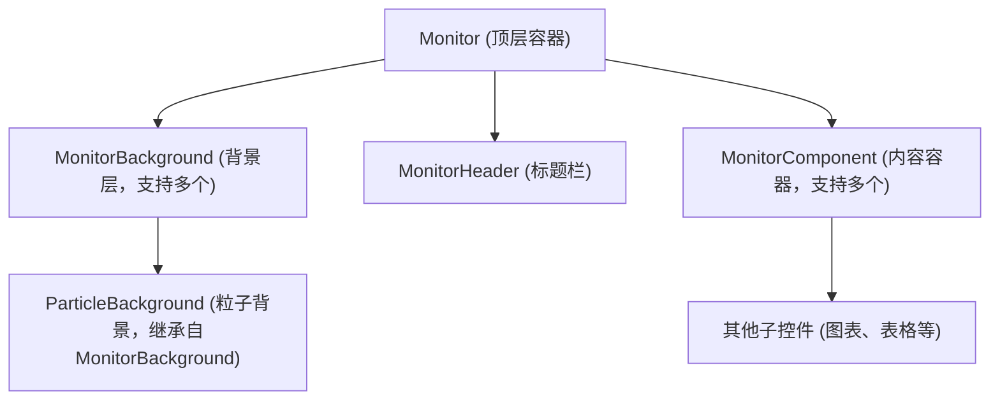

---

#### 2.1 Monitor - 顶层容器控件

**文件位置**: `/webapp/ui/control/Monitor.js` 及配套渲染器

**功能概述**:

作为整个数据大屏的根容器，`Monitor` 控件负责协调所有子控件（背景、标题、内容控件）的布局与渲染。它是连接XML视图声明与CSS Grid布局实现的核心枢纽。

**核心特性**：

* **三层结构**：采用背景层 (`backgrounds`)、标题栏 (`header`)、内容区 (`components`) 的经典分层设计。
* **CSS Grid驱动**：通过 `gridName` 属性将布局控制权完全交给CSS，实现高度灵活的屏幕分割。
* **多控件管理**：支持容纳多个 `MonitorComponent` 内容控件。

**元数据定义**:

```javascript
// Monitor.js 核心结构
return Control.extend("cdm.ui.control.Monitor", {
    metadata: {
        properties: {
            gridName: { type: "string", defaultValue: "" }, // 关键：关联CSS网格模板
        },
        aggregations: {
            backgrounds: { type: "cdm.ui.control.MonitorBackground", multiple: true },
            header: { type: "cdm.ui.control.MonitorHeader", multiple: false },
            components: { type: "cdm.ui.control.MonitorComponent", multiple: true }
        },
        renderer: MonitorRenderer
    }
});
```

**XML配置示例**:

在XML视图中，通过`gridName`指定布局标识符。

```xml
<!-- S01.view.xml -->
<cus:Monitor id="id_S01_Monitor" gridName="S01_Grid">
    <!-- 背景、标题、内容控件等子控件在此处定义 -->
</cus:Monitor>
```

**渲染器实现**:

渲染器负责生成基础DOM结构，并将 `gridName` 作为CSS类应用到容器上。

```javascript
// MonitorRenderer.js 核心逻辑
Renderer.render = function (rm, oControl) {
    rm.openStart("div", oControl.getId()) // 关键：输出控件ID，用于DOM diff
       .class("cdm-monitor-container")
       .openEnd();
    {
        // 1. 渲染所有背景层 (使用 rm.renderControl)
        // 2. 渲染标题栏 (如果存在)
        
        // 3. 渲染主内容区，并应用 gridName 类
        rm.openStart("main")
           .class("cdm-monitor-main")
           .class(oControl.getGridName()) // 应用 gridName 类，如 "S01_Grid"
           .openEnd();
        {
            // 渲染所有 MonitorComponent 子控件
        }
        rm.close("main");
    }
    rm.close("div");
};
```

**CSS样式定义**:

在CSS文件中，为 `gridName` 定义具体的网格布局。

```css
/* style.css */
.S01_Grid { /* 对应 XML 中的 gridName="S01_Grid" */
    display: grid;
    gap: var(--cdm-component-gap);
    grid-template: /* 定义网格区域模板 */
        "S01_01 S01_02 S01_04" 3fr
        "S01_01 S01_02 S01_05" 2fr
        / 3fr 8fr 3fr;
}
```

**协作流程图**:

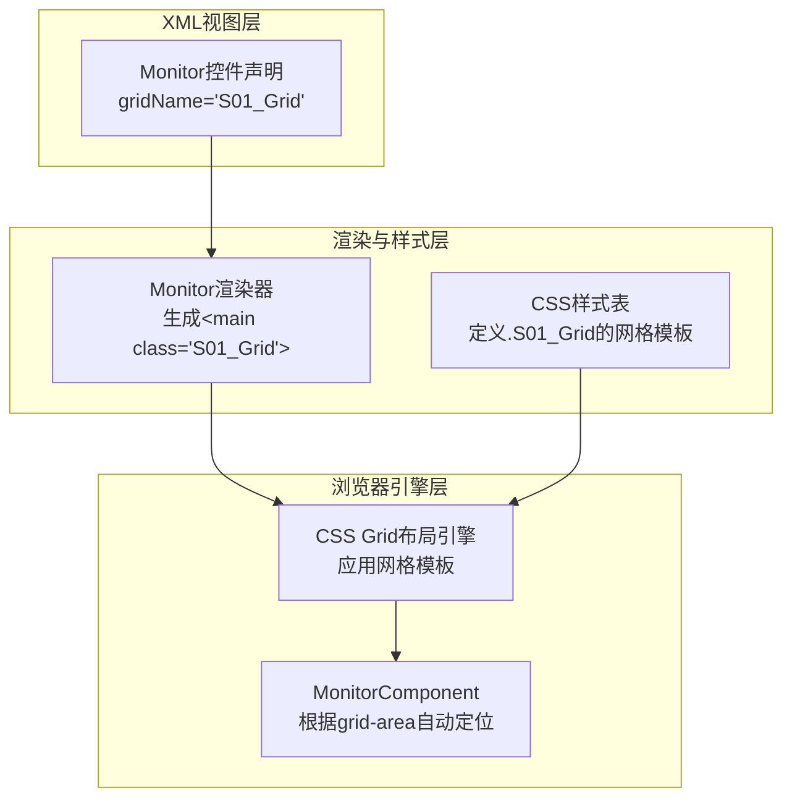

**设计优势**:

* **高度灵活**：仅修改CSS即可实现全新布局，无需改动JS/XML。
* **职责清晰**：XML管结构，CSS管样式，JS管逻辑，符合关注点分离。
* **易于维护**：屏幕布局集中定义在CSS中，一目了然，便于调整和复用。

**使用提示**:

* **最佳实践**：`gridName` 的命名应具有业务含义（如 `SalesOverview_Grid`），并与CSS文件中的类名严格对应。
* **常见问题**：如果子控件没有按预期定位，请检查：
    1. `Monitor`的`gridName`属性是否与CSS类名一致。
    2. `MonitorComponent`的`gridArea`属性值是否在CSS的 `grid-template-areas` 中定义。

---

#### 2.2 MonitorHeader - 标题栏控件

**文件位置**: `/webapp/ui/control/MonitorHeader.js` 及配套渲染器

**功能概述**:

作为数据大屏的顶部标题栏，负责展示Logo、主标题和实时时间信息，提供统一的头部视觉体验。

**核心特性**:

* **三栏网格布局**：采用CSS Grid实现Logo区、标题区、时间区的精确对齐。
* **Logo灵活支持**：支持图片Logo和文字Logo，可单独或组合使用。
* **实时时间显示**：内置自动更新的时钟，支持自定义格式。
* **CSS变量集成**：通过CSS变量（如 `--logo-size`）控制Logo尺寸。

**元数据定义**:

```javascript
// MonitorHeader.js
metadata: {
    properties: {
        title: { type: "string", defaultValue: "" },           // 主标题
        logoImage: { type: "string", defaultValue: "" },       // Logo图片URL
        logoSize: { type: "string", defaultValue: "80px" },    // Logo尺寸，通过CSS变量传递
        logoText: { type: "string", defaultValue: "" },        // 备用文字Logo
        enableTime: { type: "boolean", defaultValue: true },   // 是否显示时间
        currentTime: { type: "string", defaultValue: "" },     // 当前时间(内部使用)
    },
    renderer: MonitorHeaderRenderer
}
```

**XML配置示例**:

```xml
<!-- S01.view.xml -->
<cus:MonitorHeader
    logoImage="./images/logo.png"
    logoSize="80px"
    title="数据监控大屏"
    enableTime="true" />
```

**渲染器实现**:

渲染器构建三栏结构，并将 `logoSize` 属性作为内联样式注入，以便CSS使用。

```javascript
// MonitorHeaderRenderer.js
Renderer.render = function (rm, oControl) {
    // 将 logoSize 作为CSS变量注入，便于样式文件使用
    rm.openStart("header", oControl.getId())
        .style("--logo-size", oControl.getLogoSize())  // 注入CSS变量
        .class("cdm-monitor-header")
        .openEnd();
    {
        // 1. Logo区域 (左侧)
        rm.openStart("div").class("cdm-logo-section").openEnd();
        if (oControl.getLogoImage()) { /* 渲染图片 */ }
        if (oControl.getLogoText()) { rm.text(oControl.getLogoText()); }
        rm.close("div");

        // 2. 标题区域 (居中)
        rm.openStart("div").class("cdm-center-title").openEnd()
            .text(oControl.getTitle())
            .close("div");

        // 3. 时间区域 (右侧)
        if (oControl.getEnableTime()) {
            rm.openStart("div").class("cdm-time-info").openEnd()
                .text(oControl.getCurrentTime()) // 时间由控件逻辑更新
                .close("div");
        }
    }
    rm.close("header");
};
```

**CSS样式定义**:

利用Grid实现精确的三栏布局。

```css
/* cdm-monitor-header.css */
.cdm-monitor-header {
    display: grid;
    grid-template-columns: 1fr auto 1fr; /* 三栏：左自适应 | 中自动 | 右自适应 */
    align-items: center;
    height: var(--cdm-header-height);
    padding: 0 20px;
}

.cdm-logo-section {
    display: flex;
    align-items: center;
    gap: 15px;
    margin-right: auto; /* 确保内容左对齐 */
}

.cdm-logo-img {
    height: var(--logo-size); /* 使用通过style注入的CSS变量 */
    width: auto;
}

.cdm-center-title {
    text-align: center;
    font-size: 32px;
    font-weight: bold;
}

.cdm-time-info {
    margin-left: auto; /* 确保内容右对齐 */
    /* ... 其他样式 */
}
```

**协作流程图**:

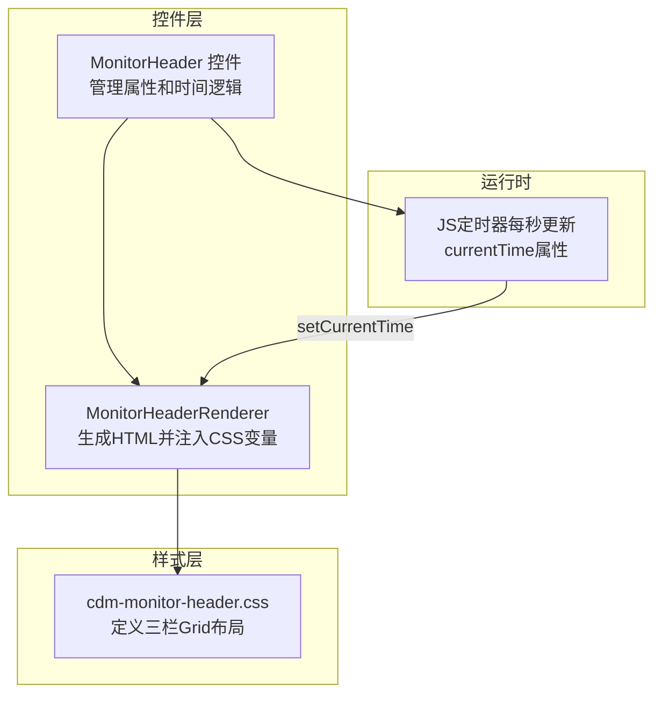

**设计优势**:

* **布局精确**：CSS Grid确保标题在任何屏幕尺寸下都严格居中。
* **逻辑内聚**：时间更新逻辑封装在控件内部，外部无需关心。
* **灵活配置**：通过属性可轻松切换Logo类型、控制时间显示。

**使用提示**:

* **最佳实践**：`logoSize` 应使用相对单位（如 `em`, `rem`, `vh`）或像素值，以确保在不同分辨率下的适应性。
* **常见问题**：如果图片Logo不显示，检查`logoImage`路径是否正确，以及服务器是否能正确返回图片资源。

---

#### 2.3 MonitorComponent - 内容容器控件

**文件位置**: `/webapp/ui/control/MonitorComponent.js` 及配套渲染器

**功能概述**:

作为数据大屏的核心内容容器，`MonitorComponent` 负责承载和布局具体的可视化控件（如图表、表格、卡片等）。它是连接CSS网格布局与具体业务内容的关键桥梁，通过 `gridArea` 属性实现精确的屏幕定位。

**核心特性**：

* **网格区域定位**：通过 `gridArea` 属性与CSS Grid模板中的区域名称绑定，实现精确的屏幕定位。
* **多样化边框样式**：支持标准、透明、无边框、光晕等多种边框效果，满足不同视觉需求。
* **灵活的内容布局**：通过 `contentFlexDirection` 属性控制内部内容的排列方向（行/列）。
* **标题区域**：提供标准的标题显示区域，与内容区域分离。
* **内容容器**：支持任意SAPUI5控件作为子内容，实现高度可扩展性。

**元数据定义**:

```javascript
// MonitorComponent.js
return Control.extend("cdm.ui.control.MonitorComponent", {
    metadata: {
        properties: {
            title: { type: "string", defaultValue: "" },           // 控件标题
            gridArea: { type: "string", defaultValue: "" },        // 关键：CSS Grid区域名称
            borderStyle: {                                         // 边框样式枚举
                type: "string",
                defaultValue: "standard",
                values: ["none", "standard", "transparent", "glow"]
            },
            contentFlexDirection: {                                // 内容排列方向
                type: "string",
                defaultValue: "column",
                values: ["row", "column", "row-reverse", "column-reverse"]
            }
        },
        aggregations: {
            content: { type: "sap.ui.core.Control", multiple: true } // 内容子控件
        },
        renderer: MonitorComponentRenderer
    }
});
```

**XML配置示例**:

```xml
<!-- S01.view.xml -->
<!-- 左上角控件 - 使用光晕边框，垂直排列内容 -->
<cus:MonitorComponent
    id="id_S01_01_MonitorComponent"
    title="核心指标"
    gridArea="S01_01"
    borderStyle="glow"
    contentFlexDirection="column">
    <cus:content>
        <!-- 这里可以添加具体的可视化控件，如echarts、表格等 -->
        <Text text="核心指标内容" />
    </cus:content>
</cus:MonitorComponent>

<!-- 中间控件 - 使用标准边框，水平排列内容 -->
<cus:MonitorComponent
    id="id_S01_02_MonitorComponent"
    title="实时数据"
    gridArea="S01_02"
    borderStyle="standard"
    contentFlexDirection="row">
    <cus:content>
        <Text text="实时数据内容" />
    </cus:content>
</cus:MonitorComponent>
```

**渲染器实现**:

渲染器生成控件结构，并将 `gridArea` 属性直接映射为CSS样式，实现网格定位。

```javascript
// MonitorComponentRenderer.js
Renderer.render = function (rm, oControl) {
    var id = oControl.getId();

    // 关键：将 gridArea 属性直接设置为内联样式，实现CSS Grid定位
    rm.openStart("div", id)
        .style("grid-area", oControl.getGridArea())  // 内联样式设置grid-area
        .class("cdm-monitor-component")
        .class("cdm-component--border-" + oControl.getBorderStyle()) // 应用边框样式类
        .openEnd(); 
    {
        // 1. 渲染标题区域（如果title不为空）
        var sTitle = oControl.getTitle();
        if (sTitle) {
            rm.openStart("div").class("cdm-component-header").openEnd();
            rm.openStart("div").class("cdm-component-title").openEnd();
            rm.text(sTitle);
            rm.close("div").close("div");
        }

        // 2. 渲染内容区域，并设置flex方向
        rm.openStart("div")
            .style("display", "flex")
            .style("flex-direction", oControl.getContentFlexDirection()) // 动态设置flex方向
            .class("cdm-component-content")
            .openEnd();
        {
            // 递归渲染所有子控件（图表、表格等）
            var aContent = oControl.getAggregation("content") || [];
            aContent.forEach(function(oContentControl) {
                rm.renderControl(oContentControl);
            });
        }
        rm.close("div"); // 关闭内容区域

    }
    rm.close("div"); // 关闭控件容器
};
```

**CSS样式定义**:

定义控件的视觉样式，特别是各种边框效果。

```css
/* cdm-monitor-component.css */
.cdm-monitor-component {
    display: flex;
    flex-direction: column;
    background-color: var(--cdm-component-bg);
    border-radius: var(--cdm-component-border-radius);
    padding: var(--cdm-component-padding);
    position: relative;
    overflow: hidden; /* 确保光晕边框不溢出 */
    transition: box-shadow var(--cdm-transition-speed) ease;
}

/* 标准边框样式 */
.cdm-component--border-standard {
    border: 1px solid var(--cdm-color-border);
    box-shadow: 0 2px 8px rgba(0, 0, 0, 0.2);
}

/* 透明边框样式 - 用于需要融入背景的场景 */
.cdm-component--border-transparent {
    border: 1px solid transparent;
    background-color: rgba(11, 17, 39, 0.6); /* 半透明背景 */
    backdrop-filter: blur(5px); /* 毛玻璃效果 */
}

/* 无边框样式 - 完全透明，用于特殊布局 */
.cdm-component--border-none {
    border: none;
    padding: 0;
    box-shadow: none;
    background-color: transparent;
}

/* 光晕边框样式 - 动态扫描效果 */
.cdm-component--border-glow {
    position: relative;
    border: none; /* 移除实体边框，使用伪元素实现 */
}

.cdm-component--border-glow::before {
    content: '';
    position: absolute;
    top: 0;
    left: 0;
    right: 0;
    bottom: 0;
    border-radius: var(--cdm-component-border-radius);
    padding: 2px; /* 边框厚度 */
    background: linear-gradient(45deg,
            var(--cdm-color-primary),
            var(--cdm-color-primary-light),
            var(--cdm-color-primary));
    background-size: 200% 200%;
    -webkit-mask: 
        linear-gradient(#fff 0 0) content-box, 
        linear-gradient(#fff 0 0);
    -webkit-mask-composite: xor;
    mask-composite: exclude;
    animation: border-scan 3s linear infinite;
    pointer-events: none; /* 确保伪元素不拦截鼠标事件 */
    z-index: 1;
}

@keyframes border-scan {
    0% { background-position: 0% 0%; }
    100% { background-position: 200% 200%; }
}

/* 标题区域样式 */
.cdm-component-header {
    margin-bottom: 12px;
    padding-bottom: 8px;
    border-bottom: 1px solid var(--cdm-color-border);
    flex-shrink: 0; /* 防止标题被压缩 */
}

.cdm-component-title {
    font-size: var(--cdm-font-size-title);
    font-weight: 600;
    color: var(--cdm-color-primary-light);
    position: relative;
    padding-left: 12px;
}

/* 标题左侧装饰线 */
.cdm-component-title::before {
    content: '';
    position: absolute;
    left: 0;
    top: 50%;
    transform: translateY(-50%);
    width: 4px;
    height: 70%;
    background: linear-gradient(to bottom, var(--cdm-color-primary), transparent);
    border-radius: 2px;
}

/* 内容区域样式 */
.cdm-component-content {
    flex: 1;
    min-height: 0; /* 确保flex子项可以滚动 */
    min-width: 0;  /* 确保flex子项可以缩小 */
    gap: var(--cdm-component-gap);
}
```

**协作流程图**:

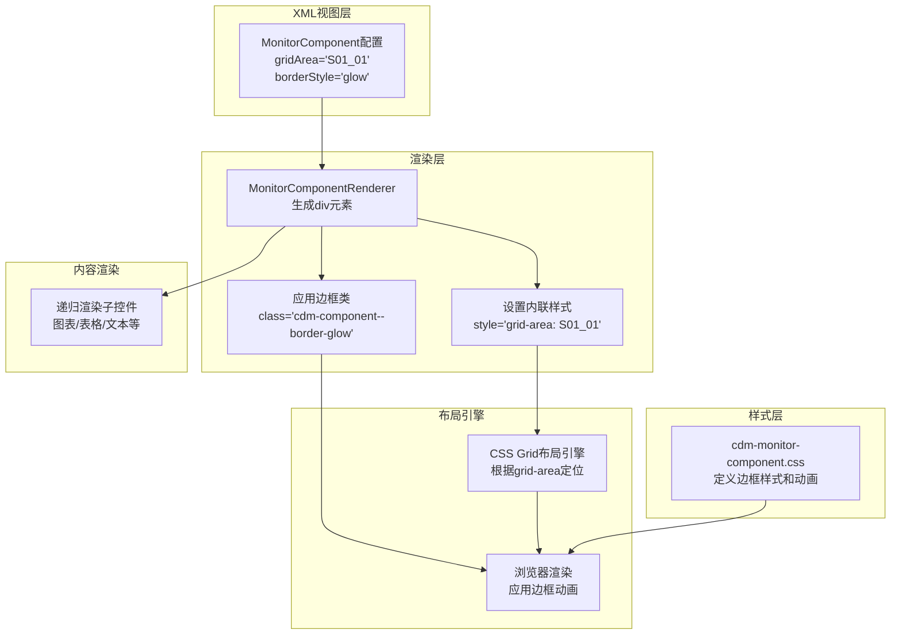

**设计优势**:

* **精准的区域定位**：通过 `grid-area` 内联样式将控件绑定到CSS Grid模板的特定区域，实现声明式的布局管理。
* **视觉丰富**：多种边框样式满足从简约到炫酷的不同场景需求。
* **布局灵活**：支持多种内容排列方向，适应不同类型的数据展示。
* **高度可扩展**：可容纳任意SAPUI5控件作为子内容，便于集成第三方库。
* **样式解耦**：视觉样式完全由CSS控制，便于统一维护和主题切换。

---

#### 2.4 MonitorBackground - 静态背景控件

**文件位置**: `/webapp/ui/control/MonitorBackground.js` 及配套渲染器

**功能概述**:

作为数据大屏的基础背景层，`MonitorBackground` 提供静态图片或纯色背景支持。它是所有背景控件的基类，为后续的特效背景（如粒子背景）提供统一的接口和渲染机制。

**核心特性**：

* **多类型背景支持**：支持图片背景和纯色背景。
* **完整的CSS背景属性**：支持位置、大小、重复、固定等所有标准CSS背景属性。
* **层级控制**：通过 `zIndex` 属性精确控制背景层的叠加顺序。
* **透明度调节**：支持背景透明度的动态调整。
* **优雅降级**：图片加载失败时自动回退到纯色背景。
* **性能优化**：使用 `pointer-events: none` 避免背景层拦截用户交互。

**元数据定义**:

```javascript
// MonitorBackground.js
return Control.extend("cdm.ui.control.MonitorBackground", {
    metadata: {
        properties: {
            src: { type: "string", defaultValue: "" },              // 背景图片URL
            position: { type: "string", defaultValue: "center center" }, // 背景位置
            size: { type: "string", defaultValue: "cover" },        // 背景大小
            repeat: { type: "string", defaultValue: "no-repeat" },  // 背景重复
            opacity: { type: "float", defaultValue: 1 },            // 透明度 0-1
            zIndex: { type: "int", defaultValue: 0 },               // Z轴层级
            fixed: { type: "boolean", defaultValue: false },        // 是否固定背景（视口）
            backgroundColor: { type: "string", defaultValue: "transparent" } // 背景颜色/渐变
        },
        renderer: MonitorBackgroundRenderer
    }
});
```

**XML配置示例**:

```xml
<!-- S01.view.xml -->
<cus:Monitor>
    <cus:backgrounds>
        <!-- 基础层：深色渐变背景 -->
        <cus:MonitorBackground
            backgroundColor="linear-gradient(135deg, #0a0f1f 0%, #1a1f35 100%)"
            zIndex="0" />
        
        <!-- 中间层：半透明网格纹理 -->
        <cus:MonitorBackground
            src="./images/grid-texture.png"
            size="50px 50px"
            repeat="repeat"
            opacity="0.15"
            zIndex="1" />
        
        <!-- 顶层：科技感光晕图片 -->
        <cus:MonitorBackground
            src="./images/glow-overlay.png"
            position="center bottom"
            size="100% auto"
            opacity="0.4"
            zIndex="2" />
    </cus:backgrounds>
    <!-- 其他控件... -->
</cus:Monitor>
```

**渲染器实现**:

渲染器将控件的属性转换为CSS样式，生成背景层元素。

```javascript
// MonitorBackgroundRenderer.js
Renderer.render = function (rm, oControl) {
    var sSrc = oControl.getSrc();
    var fOpacity = oControl.getOpacity();
    var iZIndex = oControl.getZIndex();

    rm.openStart("div", oControl.getId())
        .class("cdm-monitor-background")
        // 基础定位样式
        .style("position", "absolute")
        .style("top", "0")
        .style("left", "0")
        .style("width", "100%")
        .style("height", "100%")
        .style("z-index", iZIndex)
        .style("opacity", fOpacity.toString())
        .style("pointer-events", "none") // 关键：不拦截鼠标事件
        .style("background-color", oControl.getBackgroundColor());

    // 图片相关样式（如果有src）
    if (sSrc) {
        rm.style("background-image", `url('${sSrc}')`)
            .style("background-position", oControl.getPosition())
            .style("background-size", oControl.getSize())
            .style("background-repeat", oControl.getRepeat())
            .style("background-attachment", oControl.getFixed() ? "fixed" : "scroll");
    }

    rm.openEnd() // 结束openStart，开始输出属性
      .close("div"); // 关闭div标签
};
```

**CSS样式定义**:

背景层的基础样式已在渲染器中以内联样式定义。

**协作流程图**:

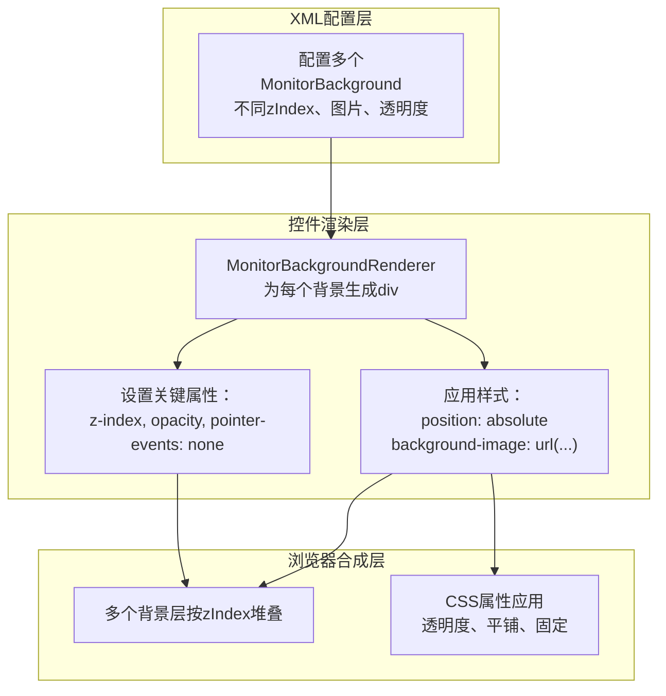

**设计优势**:

* **标准化接口**：提供统一的背景控件接口，便于扩展和复用。
* **完整的CSS支持**：支持所有标准CSS背景属性，功能全面。
* **性能优化**：使用 `pointer-events: none` 避免背景层消耗交互性能。
* **层级管理**：通过 `zIndex` 精确控制多个背景层的叠加顺序，实现复杂视觉效果。
* **继承机制**：作为基类，为特效背景（如粒子背景）提供统一的渲染框架。

**性能优化建议**:

1. **图片优化**：背景图片应使用适当的格式和压缩。对于大尺寸背景，考虑使用WebP格式，并设置合适的尺寸。

    ```javascript
    // 可以考虑在控件中添加一个方法，根据屏幕分辨率加载不同尺寸的图片
    // 但这会增加复杂度，建议在服务器端或构建时处理
    ```

2. **减少背景层数量**：尽量将视觉效果合并到较少的背景层中，例如使用CSS渐变替代多张半透明图片叠加。

3. **避免使用 `fixed` 背景**：`background-attachment: fixed` 在某些移动浏览器上可能导致性能问题或滚动卡顿。如果不需要视口固定效果，应保持默认值 `scroll`。

---

### 3. 业务控件与特效控件

为满足美化需求，开发系列自定义控件

#### 3.1 Timeline - 时间轴容器控件

**文件位置**: `/webapp/ui/control/Timeline.js` 及配套渲染器

**功能概述**:

作为时间轴控件的顶层容器，`Timeline` 控件负责管理和渲染多个时间轴条目（`TimelineItem`）。它提供了时间轴的整体布局框架，支持垂直排列的时间线展示，适用于展示时间序列数据、操作记录、进度跟踪等场景。

**核心特性**:

* **条目管理**: 支持多个 `TimelineItem` 子控件的聚合管理
* **垂直布局**: 采用经典的垂直时间轴布局，带连接线和节点图标
* **响应式设计**: 通过CSS变量实现灵活的布局调整
* **交互支持**: 支持展开/收起功能，优化空间利用

**元数据定义**:

```javascript
return Control.extend("cdm.ui.control.Timeline", {
    metadata: {
        aggregations: {
            items: { 
                type: "cdm.ui.control.TimelineItem", 
                multiple: true, 
                defaultValue: null 
            }
        },
        renderer: TimelineRenderer
    }
});
```

**XML配置示例**:

```xml
<cus:Timeline>
    <cus:items>
        <cus:TimelineItem
            dateTime="2024-01-15 10:30"
            title="系统初始化"
            text="完成系统基础配置和用户权限设置"
            checked="true" />
        <cus:TimelineItem
            dateTime="2024-01-15 14:20"
            title="数据导入"
            text="导入客户数据5000条，产品数据200条" />
        <cus:TimelineItem
            dateTime="2024-01-16 09:15"
            title="报表生成"
            text="生成月度销售分析报表" />
    </cus:items>
</cus:Timeline>
```

**渲染器实现**:

```javascript

sap.ui.define([
], function () {
    "use strict";

    var Renderer = {
        apiVersion: 2
    };

    Renderer.render = function (rm, oControl) {
        var id = oControl.getId();

        // 渲染时间轴容器
        rm.openStart("div", id)
            .class("cdm-timeline-container")
            .openEnd(); {
            rm.openStart("ul", id + "-items")
                .class("cdm-timeline")
                .openEnd(); {
                var aItems = oControl.getAggregation("items") || [];
                for (let index = 0; index < aItems.length; index++) {
                    rm.renderControl(aItems[index]);
                }
            } rm.close("ul");
        } rm.close("div");
    };

    return Renderer;
});
```

**协作流程图**:

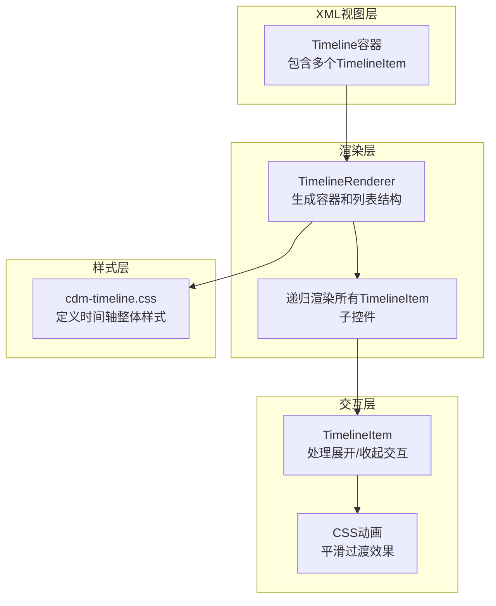

---

#### 3.2 TimelineItem - 时间轴条目控件

**文件位置**: `/webapp/ui/control/TimelineItem.js` 及配套渲染器

**功能概述**:

作为时间轴的基本单元，`TimelineItem` 控件代表一个具体的时间点事件。它采用左右分栏设计，左侧显示时间信息，右侧显示事件详情，支持展开/收起功能以优化空间利用。

**核心特性**:

* **左右分栏布局**: 左侧时间区（固定宽度），右侧内容区（自适应）
* **可折叠内容**: 支持详细内容的展开和收起

**元数据定义**:

```javascript
return Control.extend("cdm.ui.control.TimelineItem", {
    metadata: {
        properties: {
            dateTime: { type: "string", defaultValue: "", group: "Misc" },
            title: { type: "string", defaultValue: "", group: "Misc" },
            text: { type: "string", defaultValue: "", group: "Misc" },
            checked: { type: "boolean", defaultValue: false, group: "Misc" },
        },
        renderer: TimelineItemRenderer
    }
});
```

**设计优势**:

1. **灵活的布局系统**: 通过CSS变量控制左右区域比例，便于适配不同场景
2. **平滑的动画效果**: 使用CSS过渡实现展开/收起的平滑动画
3. **视觉层次清晰**: 通过颜色、大小和位置区分不同信息层级
4. **性能优化**: 纯CSS实现交互效果，无需JavaScript参与

**协作关系图**:

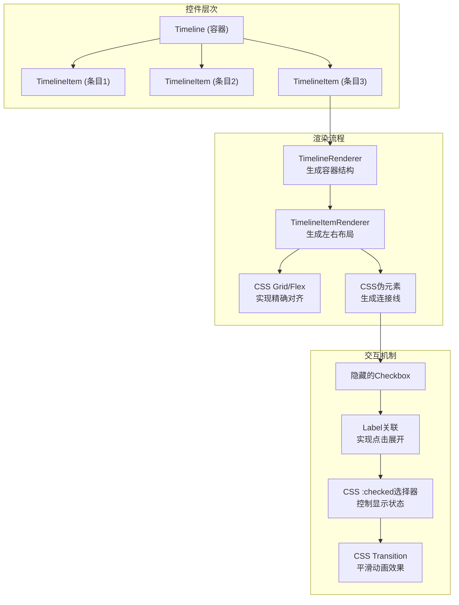

这个时间轴控件完全遵循了基础框架的设计原则，通过清晰的层次结构、灵活的CSS变量系统和纯CSS交互实现，提供了一个专业级的时间序列数据展示解决方案。

---

#### 3.3 EchartContainer - ECharts图表容器控件

**文件位置**: `/webapp/ui/control/EchartContainer.js` 及配套渲染器、样式文件

**功能概述**:

作为ECharts图表在SAPUI5中的封装容器，`EchartContainer` 控件提供了与SAPUI5框架无缝集成的ECharts图表解决方案。它负责管理ECharts实例的生命周期、主题适配、响应式布局以及与SAPUI5数据绑定的集成，使开发者能够轻松地在数据大屏中嵌入专业的可视化图表。

**核心特性**:

* **ECharts实例管理**: 自动创建和管理ECharts实例，处理初始化和销毁
* **[动态主题适配](#case-5)**: 基于CSS变量动态生成ECharts主题，确保与整体UI风格一致
* **响应式布局**: 自动监听窗口大小变化，实时调整图表尺寸
* **数据绑定支持**: 支持SAPUI5数据绑定，便于与后端数据集成
* **性能优化**: 延迟渲染、防抖处理等优化措施
* **错误处理**: 完善的错误处理和资源清理机制

**元数据定义**:

```javascript
// EchartContainer.js
return Control.extend("cdm.ui.control.EchartContainer", {
    metadata: {
        properties: {
            // ECharts配置选项
            option: { 
                type: "object", 
                defaultValue: null,
                group: "Misc" 
            }
        }
        renderer: EchartContainerRenderer
    }
});
```

**XML配置示例**:

```xml
<cus:EchartContainer
    id="idDemoChart"
    option="{localModel>/echartOption}">
</cus:EchartContainer>
```

**控制器实现**:

```javascript
// EchartContainer.js
return Control.extend("cdm.ui.control.EchartContainer", {
    init: function () {
        this._echart = null;
        // 绑定窗口大小调整事件
        window.addEventListener("resize", () => { this._handleWindowResize(); });
    },
    onAfterRendering: function (oEvent) {
        // 控件完全渲染到页面后，再对Echart控件进行初始化
        if (!this._echart) {
            this._echart = echarts.init(document.getElementById(this.getId() + "-echart"), echartTheme);
        }
    },
    setOption: function (option) {
        if (this._echart && option) {
            this._echart.setOption(option);
        }
    },
    _handleWindowResize: function () {
        if (this._echart) {
            this._echart.resize();
        }
    },
    getEchart() {
        return this._echart;
    }
});
```

**渲染器实现**:

```javascript
// EchartContainerRenderer.js
Renderer.render = function (rm, oControl) {
    var id = oControl.getId();

    rm.openStart("div", id)
        .class("cdm-echart-container")
        .openEnd(); {
        rm.openStart("div", id + "-echart")
            .style("width", "100%")
            .style("height", "100%")
            .openEnd()
            .close("div");
    } rm.close("div");
};
```

**协作流程图**:

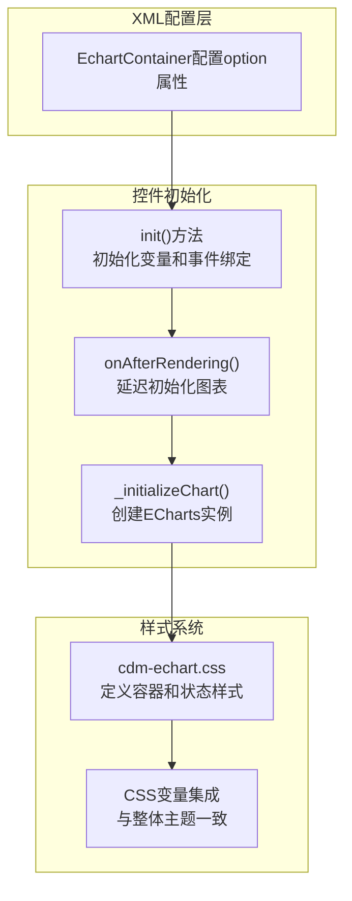

**设计优势**:

1. **无缝集成**: 将ECharts完美融入SAPUI5框架，保持一致的开发体验
2. **主题一致性**: 基于CSS变量动态生成主题，确保图表与整体UI风格统一

这个EchartContainer控件遵循了SAPUI5自定义控件的最佳实践，提供了完整的ECharts集成解决方案，使开发者能够轻松地在数据大屏中创建专业级的数据可视化图表。

---

#### 3.4 GenericCard - 通用卡片控件

**文件位置**: `/webapp/ui/control/GenericCard.js` 及配套渲染器、样式文件

**功能概述**:

`GenericCard` 是一个高度可配置的通用卡片控件，用于展示包含图片、标题、数值和描述的组合信息。它支持多种布局方式、视觉样式和交互效果，能够灵活适应不同的数据展示需求，是构建数据大屏中指标卡片、统计卡片和信息卡片的基础控件。

**核心特性**:

* **多维度数据展示**: 支持图片、标题、副标题、主次数值、描述等多种信息元素的组合展示
* **灵活布局系统**: 支持水平和垂直两种主要布局方向，内容区域可独立配置布局和对齐方式
* **丰富的视觉样式**: 提供填充和透明两种背景样式，标准和无边框两种边框样式，支持自定义颜色和尺寸
* **数值处理能力**: 内置数值格式化方法，支持数值单位的智能显示
* **响应式设计**: 通过CSS变量实现尺寸和颜色的动态调整
* **交互反馈**: 支持选中状态和悬停效果，增强用户体验

**元数据定义**:

```javascript
// GenericCard.js 核心结构
return Control.extend("cdm.ui.control.GenericCard", {
    metadata: {
        properties: {
            // 选中状态
            selected: { type: "boolean", defaultValue: false },

            // 图片相关属性
            imageSrc: { type: "string", defaultValue: "" },
            imageAlt: { type: "string", defaultValue: "" },
            imageSize: { type: "string", defaultValue: "80px" },

            // 文本内容属性
            title: { type: "string", defaultValue: "" },
            subtitle: { type: "string", defaultValue: "" },
            description: { type: "string", defaultValue: "" },

            // 数值属性
            primaryLabel: { type: "string", defaultValue: "" },
            primaryValue: { type: "string", defaultValue: "0" },
            primaryUnit: { type: "string", defaultValue: "" },
            secondaryLabel: { type: "string", defaultValue: "" },
            secondaryValue: { type: "string", defaultValue: "" },
            secondaryUnit: { type: "string", defaultValue: "" },
            showUnits: { type: "boolean", defaultValue: true },

            // 样式属性
            cardColor: { type: "string", defaultValue: "var(--cdm-card-bg)" },
            titleColor: { type: "string", defaultValue: "var(--cdm-card-title-color)" },
            valueColor: { type: "string", defaultValue: "var(--cdm-color-accent)" },
            unitColor: { type: "string", defaultValue: "var(--cdm-color-text-primary)" },
            textColor: { type: "string", defaultValue: "var(--cdm-color-text-primary)" },
            titleSize: { type: "string", defaultValue: "0.8rem" },
            valueSize: { type: "string", defaultValue: "1rem" },
            unitSize: { type: "string", defaultValue: "1rem" },
            textSize: { type: "string", defaultValue: "0.8rem" },

            // 卡片尺寸
            cardWidth: { type: "string", defaultValue: "100%" },
            cardHeight: { type: "string", defaultValue: "auto" },

            // 布局控制
            layoutDirection: {
                type: "string",
                defaultValue: "horizontal",
                values: ["horizontal", "vertical"]
            },
            contentLayout: {
                type: "string",
                defaultValue: "vertical",
                values: ["horizontal", "vertical"]
            },
            contentAlignment: {
                type: "string",
                defaultValue: "left",
                values: ["left", "center", "right"]
            },
            valuesLayout: {
                type: "string",
                defaultValue: "vertical",
                values: ["horizontal", "vertical"]
            },
            backgroundStyle: {
                type: "string",
                defaultValue: "fill",
                values: ["fill", "transparent"]
            },
            borderStyle: {
                type: "string",
                defaultValue: "normal",
                values: ["normal", "none"]
            },
        },
        renderer: GenericCardRenderer
    },

    // 数值处理方法
    setPrimaryValue: function (sValue) {
        var nValue = parseFloat(sValue) || 0;
        this.setProperty("primaryValue", nValue.toString());
        return this;
    },

    getPrimaryValueNumber: function () {
        return parseFloat(this.getProperty("primaryValue")) || 0;
    }
});
```

**XML配置示例**:

```xml
<!-- 水平布局的指标卡片 -->
<cus:GenericCard
    id="idSalesCard"
    title="销售额"
    subtitle="本月累计"
    primaryValue="1,250,000"
    primaryUnit="元"
    secondaryValue="+15.2%"
    secondaryUnit="环比"
    imageSrc="./images/sales-icon.png"
    imageSize="60px"
    layoutDirection="horizontal"
    backgroundStyle="fill"
    borderStyle="normal"
    cardWidth="300px"
    cardHeight="120px">
</cus:GenericCard>

<!-- 垂直布局的信息卡片 -->
<cus:GenericCard
    id="idUserCard"
    title="活跃用户"
    description="过去30天活跃用户数量统计"
    primaryValue="8,542"
    primaryUnit="人"
    imageSrc="./images/user-icon.png"
    layoutDirection="vertical"
    backgroundStyle="transparent"
    borderStyle="none"
    contentAlignment="center"
    valuesLayout="horizontal">
</cus:GenericCard>
```

**渲染器实现**:

`GenericCardRenderer` 负责将控件的属性转换为具体的HTML结构和CSS样式，采用模块化的渲染方法组织代码：

```javascript
// GenericCardRenderer.js 核心渲染逻辑
Renderer.render = function (rm, oControl) {
    var id = oControl.getId();

    // 渲染卡片容器，注入CSS变量和应用样式类
    rm.openStart("div", id)
        .style("width", oControl.getCardWidth())
        .style("height", oControl.getCardHeight())
        .style("--card-color", oControl.getCardColor())
        .style("--title-size", oControl.getTitleSize())
        .style("--title-color", oControl.getTitleColor())
        // ... 更多CSS变量注入
        .class("cdm-card")
        .class("cdm-card--layout-" + oControl.getLayoutDirection())
        .class("cdm-card--backgroud-" + oControl.getBackgroundStyle())
        .class("cdm-card--border-" + oControl.getBorderStyle())
        .class(!!oControl.getSelected() ? "cdm-card--selected" : "")
        .openEnd();
    {
        // 模块化渲染：图片区域
        this._renderImageArea(rm, oControl);
        
        // 模块化渲染：内容区域
        this._renderContentArea(rm, oControl);
    }
    rm.close("div");
};

// 图片区域渲染
Renderer._renderImageArea = function (rm, oControl) {
    rm.openStart("div")
        .style("--image-size", oControl.getImageSize())
        .class("cdm-card-img-area")
        .class(!!oControl.getImageSrc() ? "" : "cdm-card-img-area--hide")
        .openEnd();
    {
        if (oControl.getImageSrc()) {
            rm.openStart("img")
                .class("cdm-card-img")
                .attr("src", oControl.getImageSrc())
                .attr("alt", oControl.getImageAlt() || "图标")
                .attr("loading", "eager")
                .openEnd()
                .close("img");
        } else {
            rm.openStart("div")
                .class("cdm-card-img-placeholder")
                .openEnd()
                .close("div");
        }
    }
    rm.close("div");
};

// 内容区域渲染（包含标题、数值、描述）
Renderer._renderContentArea = function (rm, oControl) {
    rm.openStart("div")
        .class("cdm-card-content")
        .class("cdm-card-content--layout-" + oControl.getContentLayout())
        .class("cdm-card-content--align-" + oControl.getContentAlignment())
        .openEnd();
    {
        // 渲染标题和副标题
        if (oControl.getTitle()) {
            rm.openStart("div").class("cdm-card-title").openEnd()
                .text(oControl.getTitle())
                .close("div");
        }
        
        if (oControl.getSubtitle()) {
            rm.openStart("div").class("cdm-card-subtitle").openEnd()
                .text(oControl.getSubtitle())
                .close("div");
        }
        
        // 渲染数值区域
        this._renderValuesArea(rm, oControl);
        
        // 渲染描述
        if (oControl.getDescription()) {
            rm.openStart("div").class("cdm-card-description").openEnd()
                .text(oControl.getDescription())
                .close("div");
        }
    }
    rm.close("div");
};

// 数值区域渲染（主次数值）
Renderer._renderValuesArea = function (rm, oControl) {
    rm.openStart("div")
        .class("cdm-card-values")
        .class("cdm-card-values--layout-" + oControl.getValuesLayout())
        .openEnd();
    {
        // 主数值
        if (oControl.getPrimaryValue()) {
            rm.openStart("div").class("cdm-card-value-primary").openEnd();
            {
                if (oControl.getPrimaryLabel()) {
                    rm.openStart("span").class("cdm-card-label-primary").openEnd()
                        .text(oControl.getPrimaryLabel() + " ")
                        .close("span");
                }
                rm.text(oControl.getPrimaryValue());
                if (oControl.getPrimaryUnit()) {
                    rm.openStart("span").class("cdm-card-unit-primary").openEnd()
                        .text(" " + oControl.getPrimaryUnit())
                        .close("span");
                }
            }
            rm.close("div");
        }
        
        // 次数值
        if (oControl.getSecondaryValue()) {
            rm.openStart("div").class("cdm-card-value-secondary").openEnd();
            {
                if (oControl.getSecondaryLabel()) {
                    rm.openStart("span").class("cdm-card-label-secondary").openEnd()
                        .text(oControl.getSecondaryLabel() + " ")
                        .close("span");
                }
                rm.text(oControl.getSecondaryValue());
                if (oControl.getSecondaryUnit()) {
                    rm.openStart("span").class("cdm-card-unit-secondary").openEnd()
                        .text(" " + oControl.getSecondaryUnit())
                        .close("span");
                }
            }
            rm.close("div");
        }
    }
    rm.close("div");
};
```

**CSS样式定义**:

卡片样式通过CSS变量和类名系统实现高度可定制化：

```css
/* cdm-generic-card.css 核心样式 */
/* 卡片基础容器 */
.cdm-card {
    margin: 0 auto;
    overflow: hidden;
    transition: transform 0.3s ease, box-shadow 0.3s ease;
    position: relative;
}

/* 布局变体 */
.cdm-card--layout-horizontal {
    display: flex;
    flex-direction: row;
    align-items: center;
    height: 100%;
    padding: 10px;
    gap: 15px;
}

.cdm-card--layout-vertical {
    display: flex;
    flex-direction: column;
    height: 100%;
    padding: 15px;
    gap: 10px;
}

/* 背景样式变体 */
.cdm-card--backgroud-fill {
    background: var(--card-color);
    box-shadow: 0 4px 20px rgba(0, 0, 0, 0.3);
}

.cdm-card--backgroud-fill:hover {
    transform: translateY(-5px);
    box-shadow: 0 15px 35px rgba(0, 0, 0, 0.5);
}

.cdm-card--backgroud-transparent {
    background: transparent;
    box-shadow: none;
}

/* 边框样式变体 */
.cdm-card--border-normal {
    border: 1px solid rgba(255, 255, 255, 0.1);
    border-radius: 16px;
}

.cdm-card--border-none {
    border: none;
}

/* 内容区域布局 */
.cdm-card-content {
    flex: 1;
    display: flex;
    flex-direction: column;
    justify-content: center;
    min-width: 0;
}

.cdm-card-content--layout-horizontal {
    display: flex;
    flex-direction: row;
    justify-content: space-between;
    align-items: center;
    gap: 15px;
    width: 100%;
}

.cdm-card-content--layout-vertical {
    display: flex;
    flex-direction: column;
    gap: 8px;
}

/* 内容对齐方式 */
.cdm-card-content--align-center {
    align-items: center;
    text-align: center;
}

.cdm-card-content--align-left {
    align-items: flex-start;
    text-align: left;
}

.cdm-card-content--align-right {
    align-items: flex-end;
    text-align: right;
}

/* 图片区域 */
.cdm-card-img-area {
    display: flex;
    justify-content: center;
    align-items: center;
    flex-shrink: 0;
    filter: drop-shadow(0 0 10px var(--card-color, rgba(52, 152, 219, 0.5)));
}

.cdm-card-img {
    width: var(--image-size, 80px);
    height: var(--image-size, 80px);
    object-fit: contain;
    transition: transform 0.3s ease;
}

/* 文本样式 */
.cdm-card-title {
    font-size: var(--title-size, 0.8rem);
    font-weight: 600;
    color: var(--title-color, #3498db);
    margin-bottom: 4px;
    overflow: hidden;
    text-overflow: ellipsis;
    display: -webkit-box;
    -webkit-line-clamp: 2;
    -webkit-box-orient: vertical;
}

/* 数值区域 */
.cdm-card-values {
    display: flex;
    flex-direction: column;
    gap: 6px;
}

.cdm-card-values--layout-horizontal {
    display: flex;
    flex-direction: row;
    gap: 15px;
    align-items: center;
    justify-content: center;
}

.cdm-card-value-primary {
    font-size: var(--value-size, 1rem);
    font-weight: 800;
    color: var(--value-color, #f1c40f);
}
```

**设计模式解析**:

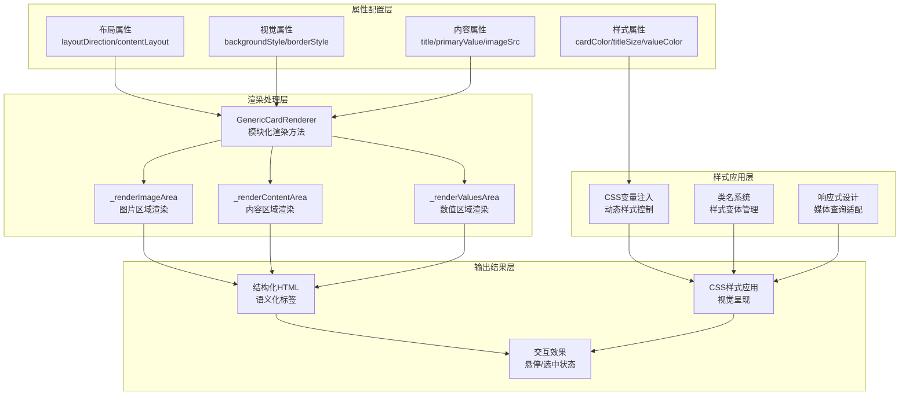

**使用场景示例**:
    ```xml
    <cus:GenericCard
        title="订单数量"
        primaryValue="1,248"
        primaryUnit="单"
        secondaryValue="+12%"
        secondaryUnit="日环比"
        layoutDirection="horizontal"
        backgroundStyle="fill"
        valueColor="#4CAF50">
    </cus:GenericCard>
    ```

**设计优势**:

1. **高度可配置**: 通过丰富的属性系统，卡片可以适应各种展示需求
2. **视觉一致性**: CSS变量系统确保卡片样式与整体主题保持一致
3. **可维护性**: 清晰的代码结构和分离的关注点便于后续维护和扩展
4. **响应式友好**: 基于Flexbox的布局系统天然支持响应式设计

---

#### 3.5 GenericCardsContainer - 卡片容器控件

**文件位置**: `/webapp/ui/control/GenericCardsContainer.js` 及配套渲染器、样式文件

**功能概述**:

`GenericCardsContainer` 是一个高级布局容器控件，专门用于管理和排列多个 `GenericCard` 控件。它提供了两种主流的布局系统（Flexbox 和 CSS Grid），支持复杂的卡片排列需求，并集成了背景层管理功能，是构建卡片式数据大屏的核心布局控件。

**核心特性**:

* **双布局引擎**: 支持 Flexbox 和 CSS Grid 两种现代布局系统，满足不同场景需求
* **完整的布局控制**: 提供全面的布局属性，包括方向、对齐、间距、模板等
* **背景层管理**: 支持多个 `MonitorBackground` 背景层，实现复杂的视觉叠加效果
* **响应式设计**: 内置响应式断点，自动适应不同屏幕尺寸
* **容器样式定制**: 支持边框、阴影、圆角等完整的容器样式配置

**元数据定义**:

```javascript
// GenericCardsContainer.js 核心结构
return Control.extend("cdm.ui.control.GenericCardsContainer", {
    metadata: {
        properties: {
            // 布局类型选择
            layoutType: {
                type: "string",
                defaultValue: "flex",
                values: ["flex", "grid"]
            },

            // Flex布局属性组
            flexDirection: {
                type: "string",
                defaultValue: "row",
                values: ["row", "column", "row-reverse", "column-reverse"]
            },
            flexWrap: {
                type: "string",
                defaultValue: "wrap",
                values: ["wrap", "nowrap", "wrap-reverse"]
            },
            justifyContent: {
                type: "string",
                defaultValue: "flex-start",
                values: ["flex-start", "flex-end", "center", "space-between", "space-around", "space-evenly"]
            },
            alignItems: {
                type: "string",
                defaultValue: "stretch",
                values: ["stretch", "flex-start", "flex-end", "center", "baseline"]
            },
            alignContent: {
                type: "string",
                defaultValue: "stretch",
                values: ["stretch", "flex-start", "flex-end", "center", "space-between", "space-around"]
            },
            flexGap: {
                type: "string",
                defaultValue: "16px"
            },

            // Grid布局属性组
            gridTemplateColumns: {
                type: "string",
                defaultValue: "repeat(auto-fill, minmax(250px, 1fr))"
            },
            gridTemplateRows: {
                type: "string",
                defaultValue: "auto"
            },
            gridAutoFlow: {
                type: "string",
                defaultValue: "row",
                values: ["row", "column", "row dense", "column dense"]
            },
            gridGap: {
                type: "string",
                defaultValue: "16px"
            },
            gridJustifyItems: {
                type: "string",
                defaultValue: "stretch",
                values: ["stretch", "start", "end", "center"]
            },
            gridAlignItems: {
                type: "string",
                defaultValue: "stretch",
                values: ["stretch", "start", "end", "center", "baseline"]
            },

            // 容器通用样式属性
            containerWidth: {
                type: "string",
                defaultValue: "100%"
            },
            containerHeight: {
                type: "string",
                defaultValue: "auto"
            },
            containerPadding: {
                type: "string",
                defaultValue: "0"
            },
            containerMargin: {
                type: "string",
                defaultValue: "0"
            },
            backgroundColor: {
                type: "string",
                defaultValue: "transparent"
            },
            borderStyle: {
                type: "string",
                defaultValue: "none",
                values: ["none", "solid", "dashed", "dotted"]
            },
            borderWidth: {
                type: "string",
                defaultValue: "1px"
            },
            borderColor: {
                type: "string",
                defaultValue: "#e0e0e0"
            },
            borderRadius: {
                type: "string",
                defaultValue: "0"
            },
            boxShadow: {
                type: "string",
                defaultValue: "none"
            }
        },
        aggregations: {
            // 背景层聚合（支持多个MonitorBackground）
            backgrounds: { 
                type: "cdm.ui.control.MonitorBackground", 
                multiple: true, 
                defaultValue: null, 
                singularName: "background" 
            },
            // 卡片聚合（支持任意控件，通常为GenericCard）
            cards: { 
                type: "sap.ui.core.Control", 
                multiple: true, 
                defaultValue: null, 
                singularName: "card" 
            },
        },
        renderer: GenericCardsContainerRenderer
    }
});
```

**XML配置示例**:

```xml
<!-- Flex布局的卡片容器 -->
<cus:GenericCardsContainer
    id="idFlexContainer"
    layoutType="flex"
    flexDirection="row"
    flexWrap="wrap"
    justifyContent="space-between"
    alignItems="center"
    flexGap="20px"
    containerPadding="20px"
    backgroundColor="rgba(11, 17, 39, 0.8)"
    borderStyle="solid"
    borderWidth="1px"
    borderColor="rgba(64, 158, 255, 0.3)"
    borderRadius="12px"
    boxShadow="0 8px 32px rgba(0, 0, 0, 0.3)">
    
    <!-- 背景层配置 -->
    <cus:backgrounds>
        <cus:MonitorBackground
            backgroundColor="linear-gradient(135deg, rgba(11, 17, 39, 0.9) 0%, rgba(26, 31, 58, 0.7) 100%)"
            zIndex="0" />
        <cus:MonitorBackground
            src="./images/grid-pattern.png"
            size="50px 50px"
            repeat="repeat"
            opacity="0.1"
            zIndex="1" />
    </cus:backgrounds>
    
    <!-- 卡片内容 -->
    <cus:cards>
        <cus:GenericCard
            title="销售额"
            primaryValue="1,250,000"
            primaryUnit="元"
            cardWidth="280px" />
        <cus:GenericCard
            title="订单数"
            primaryValue="8,542"
            primaryUnit="单"
            cardWidth="280px" />
        <cus:GenericCard
            title="用户数"
            primaryValue="25,847"
            primaryUnit="人"
            cardWidth="280px" />
    </cus:cards>
</cus:GenericCardsContainer>
```

**渲染器实现**:

`GenericCardsContainerRenderer` 根据布局类型动态应用不同的CSS样式，并智能管理背景层的渲染顺序：

```javascript
// GenericCardsContainerRenderer.js 核心渲染逻辑
Renderer.render = function (rm, oControl) {
    var id = oControl.getId();
    var layoutType = oControl.getProperty("layoutType");

    // 开始渲染容器
    rm.openStart("div", id)
        .class("cdm-cards-container")
        .class("cdm-cards-container--layout-" + layoutType)
        
        // 应用通用容器样式
        .style("width", oControl.getProperty("containerWidth"))
        .style("height", oControl.getProperty("containerHeight"))
        .style("padding", oControl.getProperty("containerPadding"))
        .style("margin", oControl.getProperty("containerMargin"))
        .style("background-color", oControl.getProperty("backgroundColor"))
        .style("border-style", oControl.getProperty("borderStyle"))
        .style("border-width", oControl.getProperty("borderWidth"))
        .style("border-color", oControl.getProperty("borderColor"))
        .style("border-radius", oControl.getProperty("borderRadius"))
        .style("box-shadow", oControl.getProperty("boxShadow"));

    // 根据布局类型动态设置布局样式
    if (layoutType === "flex") {
        rm.style("display", "flex")
            .style("flex-direction", oControl.getProperty("flexDirection"))
            .style("flex-wrap", oControl.getProperty("flexWrap"))
            .style("justify-content", oControl.getProperty("justifyContent"))
            .style("align-items", oControl.getProperty("alignItems"))
            .style("align-content", oControl.getProperty("alignContent"))
            .style("gap", oControl.getProperty("flexGap"));
    } else if (layoutType === "grid") {
        rm.style("display", "grid")
            .style("grid-template-columns", oControl.getProperty("gridTemplateColumns"))
            .style("grid-template-rows", oControl.getProperty("gridTemplateRows"))
            .style("grid-auto-flow", oControl.getProperty("gridAutoFlow"))
            .style("gap", oControl.getProperty("gridGap"))
            .style("justify-items", oControl.getProperty("gridJustifyItems"))
            .style("align-items", oControl.getProperty("gridAlignItems"));
    }

    rm.openEnd();

    // 渲染背景层容器（按z-index排序）
    var aBackgrounds = oControl.getAggregation("backgrounds") || [];
    if (aBackgrounds.length > 0) {
        rm.openStart("div", id + "-backgrounds")
            .class("cdm-cards-container-backgrounds")
            .openEnd();

        // 按 z-index 升序排序，确保正确的视觉层次
        aBackgrounds.sort(function (a, b) {
            return (a.getZIndex() || 0) - (b.getZIndex() || 0);
        });

        // 渲染所有背景层
        aBackgrounds.forEach(function (oBackground) {
            rm.renderControl(oBackground);
        });

        rm.close("div");
    }

    // 渲染所有卡片控件
    var aCards = oControl.getAggregation("cards") || [];
    for (let index = 0; index < aCards.length; index++) {
        rm.renderControl(aCards[index]);
    }

    rm.close("div");
};
```

**CSS样式定义**:

容器样式系统提供了基础样式和响应式适配：

```css
/* cdm-generic-card.css 容器部分 */
/* 通用卡片容器基础样式 */
.cdm-cards-container {
    box-sizing: border-box;
    position: relative;
    transition: all 0.3s ease;
}

/* 背景容器 - 绝对定位，不干扰内容布局 */
.cdm-cards-container-backgrounds {
    position: absolute;
    top: 0;
    left: 0;
    width: 100%;
    height: 100%;
    z-index: 0;
    overflow: hidden;
    pointer-events: none; /* 背景不拦截交互 */
}

/* 布局类型标识类 */
.cdm-cards-container--layout-flex {
    display: flex;
}

.cdm-cards-container--layout-grid {
    display: grid;
}

/* 响应式断点适配 */
@media (max-width: 768px) {
    /* 移动端：Flex容器改为垂直布局 */
    .cdm-cards-container--layout-flex {
        flex-direction: column !important;
        flex-wrap: nowrap !important;
        gap: 12px !important;
    }
    
    /* 移动端：Grid容器自适应列数 */
    .cdm-cards-container--layout-grid {
        grid-template-columns: repeat(auto-fill, minmax(200px, 1fr)) !important;
        gap: 16px !important;
    }
    
    /* 移动端容器内边距调整 */
    .cdm-cards-container {
        padding: 16px !important;
    }
}

@media (max-width: 480px) {
    /* 小屏幕：单列布局 */
    .cdm-cards-container--layout-grid {
        grid-template-columns: 1fr !important;
    }
    
    /* 小屏幕卡片间距优化 */
    .cdm-cards-container--layout-flex,
    .cdm-cards-container--layout-grid {
        gap: 10px !important;
    }
}

/* 容器交互效果 */
.cdm-cards-container:hover {
    box-shadow: 0 12px 40px rgba(0, 0, 0, 0.4);
}

/* 容器内卡片悬停时的层级调整 */
.cdm-cards-container .cdm-card:hover {
    z-index: 10;
    position: relative;
}
```

---

#### 3.6 Tag - 基础标签控件

**文件位置**: `/webapp/ui/control/Tag.js` 及配套渲染器

**功能概述**:

`Tag` 控件是一个轻量级的基础标签控件，用于展示带有编码和名称的标签项。它采用简洁的视觉设计，支持交互反馈，是构建标签系统的基础单元。标签控件常用于分类、筛选、状态标识等场景，为数据大屏提供灵活的信息标记能力。

**核心特性**:

* **双信息展示**: 同时显示标签编码（`tagCode`）和标签名称（`tagName`），适用于需要编码-名称对的应用场景
* **紧凑布局**: 采用水平排列的紧凑设计，最大化利用空间
* **交互反馈**: 支持悬停效果，增强用户体验
* **视觉一致性**: 遵循整体设计语言，使用CSS变量确保与主题一致
* **轻量级实现**: 代码简洁，渲染高效，适合大量使用

**元数据定义**:

```javascript
// Tag.js
return Control.extend("cdm.ui.control.Tag", {
    metadata: {
        properties: {
            "tagCode": {
                type: "string",
                defaultValue: ""  // 标签编码，如"001"、"A01"
            },
            "tagName": {
                type: "string",
                defaultValue: ""  // 标签名称，如"高优先级"、"进行中"
            }
        },
        renderer: TagRenderer
    }
});
```

**XML配置示例**:

```xml
<!-- 单个标签使用示例 -->
<cus:Tag
    tagCode="001"
    tagName="高优先级" />

<!-- 带编码的标签 -->
<cus:Tag
    tagCode="A01"
    tagName="销售部" />

<!-- 仅名称的标签（编码为空时自动隐藏编码区域） -->
<cus:Tag
    tagName="已完成" />
```

**渲染器实现**:

```javascript
// TagRenderer.js 核心渲染逻辑
Renderer.render = function (rm, oControl) {
    var id = oControl.getId();

    // 渲染标签容器
    rm.openStart("div", id)
        .class("cdm-tag")
        .openEnd();
    {
        // 条件渲染标签编码（如果存在）
        var tagCode = oControl.getTagCode();
        if (tagCode) {
            rm.openStart("span", id + "-code")
                .class("cdm-tag-code")
                .openEnd();
            {
                rm.text(oControl.getTagCode());
            }
            rm.close("span");
        }

        // 渲染标签名称
        rm.openStart("span", id + "-name")
            .class("cdm-tag-name")
            .openEnd();
        {
            rm.text(oControl.getTagName());
        }
        rm.close("span");
    }
    rm.close("div");
};
```

**CSS样式定义**:

```css
/* cdm-tag.css - 基础标签样式 */
.cdm-tag {
    display: flex;
    align-items: center;
    padding: 6px 10px;
    border-radius: 8px;
    cursor: pointer;
    transition: all 0.2s ease;
    flex-shrink: 0;
    max-width: 100%;
    position: relative;
    overflow: hidden;
    border: 1px solid var(--cdm-color-primary-light);
    background-color: rgba(64, 158, 255, 0.1);
}

.cdm-tag:hover {
    box-shadow: 0 4px 8px rgba(0, 0, 0, 0.1);
    background-color: var(--cdm-color-primary);
    transform: translateY(-2px);
}

.cdm-tag-code {
    display: inline-block;
    font-weight: bold;
    margin-right: 6px;
    font-size: small;
    opacity: 0.9;
    color: var(--cdm-color-accent);
}

.cdm-tag-name {
    display: inline-block;
    font-weight: bold;
    font-size: small;
    opacity: 0.9;
    color: var(--cdm-color-text-primary);
}

/* 悬停时文字颜色变化 */
.cdm-tag:hover .cdm-tag-code,
.cdm-tag:hover .cdm-tag-name {
    color: white;
    opacity: 1;
}
```

**设计优势**:

1. **智能渲染**: 当 `tagCode` 为空时自动隐藏编码区域，保持界面整洁
2. **语义化结构**: 使用 `span` 元素包裹编码和名称，便于CSS样式控制和屏幕阅读器识别
3. **性能优化**: 轻量级DOM结构，适合大量标签的渲染场景
4. **可访问性**: 完整的ID系统和语义化标签，支持辅助技术

---

#### 3.7 TagsContainer - 标签容器控件

**文件位置**: `/webapp/ui/control/TagsContainer.js` 及配套渲染器

**功能概述**:

`TagsContainer` 是一个专门用于管理和布局多个 `Tag` 控件的容器控件。它提供了灵活的标签排列能力，支持自动换行、滚动和间距控制，是构建标签云、标签筛选器、多标签展示区域的核心布局控件。

**核心特性**:

* **自动换行布局**: 使用Flexbox的 `flex-wrap: wrap` 实现智能换行，适应不同容器宽度
* **滚动支持**: 当标签数量超出可视区域时，自动启用垂直滚动
* **间距控制**: 通过CSS Gap属性精确控制标签间距
* **对齐方式**: 支持多种内容对齐方式（居左、居中、居右）
* **聚合管理**: 统一管理多个 `Tag` 子控件，简化XML配置

**元数据定义**:

```javascript
// TagsContainer.js
return Control.extend("cdm.ui.control.TagsContainer", {
    metadata: {
        aggregations: {
            tags: { 
                type: "cdm.ui.control.Tag", 
                multiple: true, 
                defaultValue: null 
            }
        },
        renderer: TagsContainerRenderer
    }
});
```

**XML配置示例**:

```xml
<!-- 基础标签容器 -->
<cus:TagsContainer>
    <cus:tags>
        <cus:Tag tagCode="001" tagName="高优先级" />
        <cus:Tag tagCode="002" tagName="进行中" />
        <cus:Tag tagCode="003" tagName="待审核" />
        <cus:Tag tagCode="004" tagName="已完成" />
        <cus:Tag tagCode="005" tagName="已取消" />
        <cus:Tag tagName="紧急" />
        <cus:Tag tagName="重要" />
        <cus:Tag tagName="普通" />
    </cus:tags>
</cus:TagsContainer>

<!-- 在MonitorComponent中使用 -->
<cus:MonitorComponent
    title="任务标签"
    gridArea="S01_03"
    borderStyle="standard">
    <cus:content>
        <cus:TagsContainer>
            <cus:tags>
                <!-- 标签内容 -->
            </cus:tags>
        </cus:TagsContainer>
    </cus:content>
</cus:MonitorComponent>
```

**渲染器实现**:

```javascript
// TagsContainerRenderer.js 核心渲染逻辑
Renderer.render = function (rm, oControl) {
    var id = oControl.getId();

    // 渲染标签容器
    rm.openStart("div", id)
        .class("cdm-tags-container")
        .openEnd();
    {
        // 递归渲染所有Tag子控件
        var aTags = oControl.getAggregation("tags") || [];
        for (let index = 0; index < aTags.length; index++) {
            rm.renderControl(aTags[index]);
        }
    }
    rm.close("div");
};
```

**CSS样式定义**:

```css
/* cdm-tag.css - 标签容器样式 */
.cdm-tags-container {
    flex: 1;
    display: flex;
    flex-wrap: wrap;
    align-content: flex-start;
    gap: 8px;
    overflow-y: auto;
    padding: 10px;
    min-height: 0; /* 确保Flex容器正确收缩 */
}

/* 容器滚动条美化 */
.cdm-tags-container::-webkit-scrollbar {
    width: 6px;
}

.cdm-tags-container::-webkit-scrollbar-track {
    background: rgba(255, 255, 255, 0.05);
    border-radius: 3px;
}

.cdm-tags-container::-webkit-scrollbar-thumb {
    background: var(--cdm-color-primary);
    border-radius: 3px;
}

.cdm-tags-container::-webkit-scrollbar-thumb:hover {
    background: var(--cdm-color-primary-light);
}

/* 响应式调整 */
@media (max-width: 768px) {
    .cdm-tags-container {
        gap: 6px;
        padding: 8px;
    }
    
    .cdm-tag {
        padding: 4px 8px;
        font-size: 0.9em;
    }
}
```

**协作流程图**:

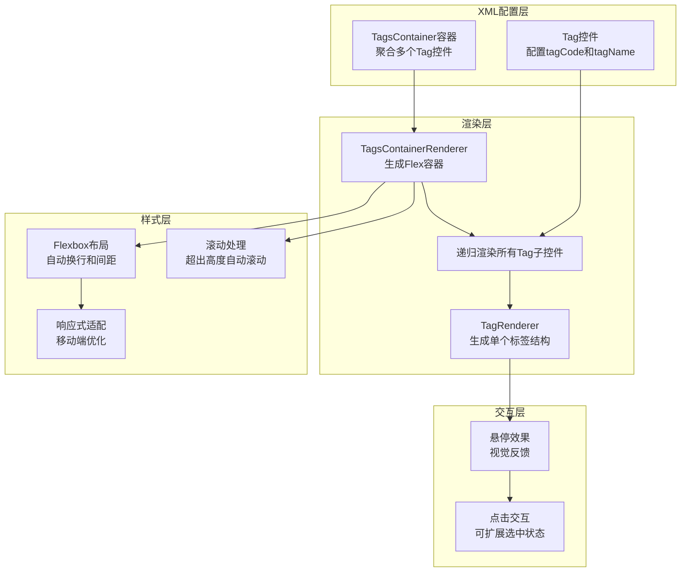

**使用场景示例**:
    ```xml
    <cus:TagsContainer>
        <cus:tags>
            <cus:Tag tagCode="DEPT_001" tagName="销售部" />
            <cus:Tag tagCode="DEPT_002" tagName="技术部" />
            <cus:Tag tagCode="DEPT_003" tagName="市场部" />
            <cus:Tag tagCode="DEPT_004" tagName="财务部" />
        </cus:tags>
    </cus:TagsContainer>
    ```

**设计优势**:

1. **布局灵活**: 自动换行机制适应不同宽度容器，无需手动计算位置
2. **性能优异**: 轻量级实现，即使大量标签也能保持流畅渲染
3. **易于使用**: 简单的聚合模型，XML配置直观清晰
4. **可扩展性强**: 可作为基础控件，扩展选中状态、过滤功能等
5. **主题一致**: 完全集成到CDM设计系统中，保持视觉统一

标签控件系统为数据大屏提供了灵活的信息标记和分类能力，通过简洁的设计和高效的实现，能够很好地融入整体架构，满足各种标签展示需求。

---

#### 3.8 TabBar - 标签导航栏控件

**文件位置**:

* `/webapp/ui/control/TabBar.js` - 标签栏容器
* `/webapp/ui/control/TabBarItem.js` - 标签项控件
* `/webapp/ui/control/TabBarRenderer.js` - 标签栏渲染器
* `/webapp/ui/control/TabBarItemRenderer.js` - 标签项渲染器
* `/webapp/css/cdm-tab-bars.css` - 样式定义

**功能概述**:

`TabBar` 是一个完整的标签导航栏控件系统，由容器控件 `TabBar` 和子项控件 `TabBarItem` 组成。它提供了类似传统标签页的导航功能，但采用了更具科技感的视觉设计——独特的平行四边形标签造型，适用于数据大屏中的多视图切换、分类导航和内容分区场景。

**核心特性**:

* **双控件结构**：采用容器-子项分离设计，`TabBar` 负责整体布局和状态管理，`TabBarItem` 负责单个标签及其对应的内容面板。
* **平行四边形标签**：通过CSS `skew` 变换实现锐利的平行四边形标签造型，增强科技感视觉效果。
* **标签-面板联动**：点击标签自动切换对应的内容面板，支持激活状态样式变化。
* **图标支持**：标签项支持配置图标，增强视觉识别性。
* **事件系统**：提供 `select` 事件，便于外部监听标签切换。
* **灵活的样式变体**：通过CSS类支持多种视觉风格（最小化、圆角、锐角等）。

**元数据定义**:

=== "TabBar.js - 容器控件"

    ```javascript
    // TabBar.js
    return Control.extend("cdm.ui.control.TabBar", {
        metadata: {
            properties: {
                selectedKey: { type: "string", defaultValue: "" }  // 当前选中项的key
            },
            aggregations: {
                items: { type: "cdm.ui.control.TabBarItem", multiple: true, defaultValue: null } // 标签项集合
            },
            events: {
                select: {  // 标签选中事件
                    parameters: {
                        selectedItem: { type: "cdm.ui.control.TabBarItem" },
                        selectedKey: { type: "string" }
                    }
                }
            },
            renderer: TabBarRenderer
        }
    });
    ```

=== "TabBarItem.js - 标签项控件"

    ```javascript
    // TabBarItem.js
    return Control.extend("cdm.ui.control.TabBarItem", {
        metadata: {
            properties: {
                text: { type: "string", defaultValue: "" },      // 标签文本
                key: { type: "string", defaultValue: "" },       // 唯一标识
                icon: { type: "string", defaultValue: "" },      // 图标URI
            },
            aggregations: {
                panel: { type: "sap.ui.core.Control", multiple: true, defaultValue: null } // 标签对应的内容面板
            },
            renderer: TabBarItemRenderer
        }
    });
    ```

**XML配置示例**:

```xml
<!-- 完整标签导航栏示例 -->
<cus:TabBar id="idMainTabBar" selectedKey="tab1">
    <cus:items>
        <!-- 标签1：概览视图 -->
        <cus:TabBarItem
            key="tab1"
            text="概览"
            icon="sap-icon://home">
            <cus:panel>
                <Text text="概览内容区域" />
                <!-- 这里可以放置图表、表格等内容 -->
            </cus:panel>
        </cus:TabBarItem>
        
        <!-- 标签2：数据监控 -->
        <cus:TabBarItem
            key="tab2"
            text="数据监控"
            icon="sap-icon://monitor-policy">
            <cus:panel>
                <cus:EchartContainer option="{model>/chartOption}" />
            </cus:panel>
        </cus:TabBarItem>
        
        <!-- 标签3：系统状态 -->
        <cus:TabBarItem
            key="tab3"
            text="系统状态"
            icon="sap-icon://sys-monitor">
            <cus:panel>
                <cus:GenericCardsContainer layoutType="flex">
                    <cus:cards>
                        <cus:GenericCard title="CPU使用率" primaryValue="45%" />
                        <cus:GenericCard title="内存使用" primaryValue="62%" />
                    </cus:cards>
                </cus:GenericCardsContainer>
            </cus:panel>
        </cus:TabBarItem>
    </cus:items>
</cus:TabBar>

<!-- 在MonitorComponent中使用 -->
<cus:MonitorComponent
    title="导航区域"
    gridArea="S01_03"
    borderStyle="standard">
    <cus:content>
        <cus:TabBar selectedKey="overview">
            <cus:items>
                <!-- 标签项配置 -->
            </cus:items>
        </cus:TabBar>
    </cus:content>
</cus:MonitorComponent>
```

**渲染器实现**:

=== "TabBarRenderer.js - 核心渲染逻辑"

    `TabBarRenderer` 负责生成完整的标签栏结构，包括标签头区域和内容面板区域。

    ```javascript
    // TabBarRenderer.js
    Renderer.render = function (rm, oControl) {
        var id = oControl.getId();
        var aItems = oControl.getItems();

        // 渲染TabBar容器
        rm.openStart("div", id)
            .class("cdm-tab-bar")
            .openEnd(); {

            // 渲染标签头区域
            rm.openStart("div", id + "-header")
                .class("cdm-tab-header")
                .openEnd(); {
                // 渲染所有标签项
                aItems.forEach(function (oItem) {
                    Renderer._renderTabItem(rm, oItem);
                });
            } rm.close("div"); // 关闭标签头

            // 渲染标签内容区域
            rm.openStart("div", id + "-body")
                .class("cdm-tab-body")
                .openEnd(); {
                // 渲染所有面板
                aItems.forEach(function (oItem) {
                    Renderer._renderTabPanel(rm, oItem);
                });
            } rm.close("div"); // 关闭标签内容区域

        } rm.close("div"); // 关闭TabBar容器
    };

    /**
    * 渲染单个标签项（按钮部分）
    * @private
    */
    Renderer._renderTabItem = function (rm, oItem) {
        var id = oItem.getId();
        var sKey = oItem.getKey();
        var sText = oItem.getText();
        var sIcon = oItem.getIcon();
        var oParent = oItem.getParent();
        var sSelectedKey = oParent ? oParent.getSelectedKey() : "";
        var bActive = sKey === sSelectedKey;

        rm.openStart("button", id + "-tab")
            .class("cdm-tab-item")
            .class("cdm-tab-sharp") // 固定平行四边形样式
            .class(bActive ? "cdm-active" : "")
            .attr("data-key", sKey)
            .openEnd(); {

            // 渲染标签内容容器（用于反扭曲文本）
            rm.openStart("div")
                .class("cdm-tab-content")
                .openEnd();

            // 渲染图标（如果有）
            if (sIcon) {
                var oIcon = oItem.getAggregation("_icon");
                if (oIcon) {
                    rm.renderControl(oIcon);
                }
            }

            // 渲染文本
            if (sText) {
                rm.text(sText);
            }

            rm.close("div"); // 关闭内容容器

        } rm.close("button"); // 关闭标签按钮
    };

    /**
    * 渲染单个标签对应的内容面板
    * @private
    */
    Renderer._renderTabPanel = function (rm, oItem) {
        var id = oItem.getId();
        var aPanelItems = oItem.getPanel();

        var sKey = oItem.getKey();
        var oParent = oItem.getParent();
        var sSelectedKey = oParent ? oParent.getSelectedKey() : "";
        var bActive = sKey === sSelectedKey;

        rm.openStart("div", id)
            .class("cdm-tab-pane")
            .class(bActive ? "cdm-active" : "")
            .attr("data-key", sKey)
            .openEnd(); {

            // 递归渲染面板内的所有子控件
            aPanelItems.forEach(function (oPanelItem) {
                rm.renderControl(oPanelItem);
            });

        } rm.close("div"); // 关闭面板
    };
    ```

=== "TabBarItemRenderer.js - 标签项渲染器"

    `TabBarItemRenderer` 是一个空渲染器，因为标签项的渲染完全由 `TabBarRenderer` 统一处理。这种设计符合SAPUI5中复合控件的常见模式——子控件的渲染由父控件协调完成。

    ```javascript
    // TabBarItemRenderer.js
    Renderer.render = function (rm, oControl) {
        // TabBarItem的渲染由TabBarRenderer统一处理
        // 这里不需要单独渲染，因为TabBarItem是作为TabBar的一部分被渲染的
    };
    ```

**控件逻辑实现**:

=== "TabBar.js - 事件处理与状态管理"

    ```javascript
    // TabBar.js
    return Control.extend("cdm.ui.control.TabBar", {
        metadata: {
            // ... 元数据定义
        },

        /**
        * @override
        */
        init: function () {
            this._bEventsAttached = false; // 事件绑定标志
        },

        /**
        * 控件渲染完成后绑定事件
        * @override
        */
        onAfterRendering: function () {
            if (!this._bEventsAttached) {
                this._attachTabEvents();
                this._bEventsAttached = true;
            }
        },

        /**
        * 为所有标签项绑定点击事件
        * @private
        */
        _attachTabEvents: function () {
            var items = this.getItems();
            items.forEach((item) => {
                var domRef = item.getTabDomRef(); // 获取标签按钮的DOM引用
                if (domRef) {
                    domRef.addEventListener("click", () => {
                        this.setSelectedKey(item.getKey()); // 更新选中状态
                        this.fireSelect({ // 触发选中事件
                            selectedItem: item,
                            selectedKey: item.getKey()
                        });
                    });
                }
            });
        }
    });
    ```

=== "TabBarItem.js - 图标管理与DOM访问"

    ```javascript
    // TabBarItem.js
    return Control.extend("cdm.ui.control.TabBarItem", {
        metadata: {
            // ... 元数据定义
        },

        /**
        * 初始化，如有图标则创建Icon控件
        * @override
        */
        init: function () {
            var sIcon = this.getIcon();
            if (sIcon) {
                this.setAggregation("_icon", new Icon({
                    src: sIcon
                }));
            }
        },

        /**
        * 设置图标属性，同时更新图标控件
        * @override
        * @param {string} sIcon - 图标URI
        * @returns {this} 当前控件实例
        */
        setIcon: function (sIcon) {
            this.setProperty("icon", sIcon, true);

            // 更新图标控件
            var oIcon = this.getAggregation("_icon");
            if (oIcon) {
                oIcon.setSrc(sIcon);
            } else if (sIcon) {
                this.setAggregation("_icon", new Icon({
                    src: sIcon
                }));
            }

            return this;
        },

        /**
        * 获取标签按钮的DOM元素引用
        * @returns {HTMLElement|null} 标签按钮DOM元素
        */
        getTabDomRef: function () {
            return document.getElementById(this.getId() + "-tab");
        }
    });
    ```

**CSS样式定义**:

```css
/* cdm-tab-bars.css - TabBar控件样式 */

/* 标签栏容器 */
.cdm-tab-bar {
    display: flex;
    flex-direction: column;
    height: 100%;
}

/* 标签头区域 - 水平排列标签 */
.cdm-tab-header {
    display: flex;
    flex-wrap: wrap;
    gap: 2px;
    background-color: var(--cdm-nested-component-bg);
    border-radius: calc(var(--cdm-component-border-radius) - 4px);
    padding: 5px 10px;
}

/* 标签项基础样式 */
.cdm-tab-item {
    position: relative;
    padding: 5px 10px;
    cursor: pointer;
    background-color: var(--cdm-color-bg-secondary);
    color: var(--cdm-color-text-secondary);
    text-align: center;
    transition: all var(--cdm-transition-speed) ease;
    border: 1px solid transparent;
    outline: none;
    transform: skew(-15deg); /* 平行四边形变形 */
}

/* 标签内容 - 反扭曲，使内部文字正常显示 */
.cdm-tab-content {
    position: relative;
    z-index: 1;
    transform: skew(15deg); /* 反向扭曲抵消父元素的倾斜 */
    display: flex;
    align-items: center;
    justify-content: center;
    gap: 8px;
}

/* 悬停效果 */
.cdm-tab-item:hover {
    background-color: var(--cdm-table-row-hover-bg);
    color: var(--cdm-color-text-primary);
    border-color: var(--cdm-color-border);
}

/* 激活状态 */
.cdm-tab-item.cdm-active {
    color: var(--cdm-color-text-primary);
    z-index: 2;
    box-shadow: var(--cdm-component-shadow);
    border-color: var(--cdm-color-primary);
}

.cdm-tab-item.cdm-active:hover {
    box-shadow: var(--cdm-component-hover-shadow);
}

/* 标签内容区域容器 */
.cdm-tab-body {
    flex: 1;
    background-color: var(--cdm-nested-component-bg);
    padding: 5px 10px;
    min-height: 100px;
    overflow: auto;
}

/* 标签面板 - 默认隐藏 */
.cdm-tab-pane {
    display: none;
    animation: fadeOut 0.3s ease;
    height: 100%;
}

/* 激活的面板 - 显示 */
.cdm-tab-pane.cdm-active {
    display: block;
    animation: fadeIn 0.3s ease;
}

/* ===== 样式变体 ===== */

/* 最小化样式 - 透明背景 */
.cdm-tab-minimal {
    background-color: transparent !important;
    color: var(--cdm-color-text-secondary) !important;
    border: 1px solid var(--cdm-color-border) !important;
}

.cdm-tab-minimal.cdm-active {
    background: var(--cdm-gradient-primary) !important;
    color: white !important;
    border-color: var(--cdm-color-primary) !important;
}

/* 圆角样式 - 无倾斜 */
.cdm-tab-rounded {
    border-radius: var(--cdm-component-border-radius) !important;
    transform: none !important;
}

.cdm-tab-rounded .cdm-tab-content {
    transform: none !important;
}

/* 锐角样式 - 更大倾斜角度 */
.cdm-tab-sharp {
    transform: skew(-20deg) !important;
}

.cdm-tab-sharp .cdm-tab-content {
    transform: skew(20deg) !important;
}

/* ===== 动画效果 ===== */

@keyframes fadeIn {
    from {
        opacity: 0;
    }
    to {
        opacity: 1;
    }
}

@keyframes fadeOut {
    from {
        opacity: 1;
    }
    to {
        opacity: 0;
    }
}
```

**协作流程图**:

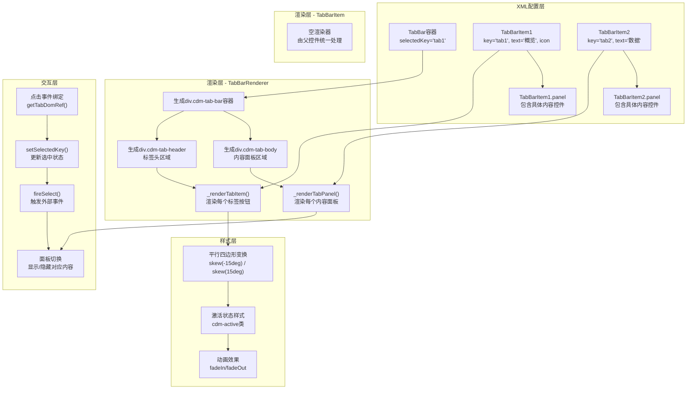

**设计优势**:

1. **独特的视觉语言**：通过 `skew` 变换实现的平行四边形标签，打破传统矩形标签的单调，增强数据大屏的科技感和视觉冲击力。
2. **分离的控件结构**：容器(`TabBar`)与子项(`TabBarItem`)的分离设计，符合SAPUI5的聚合模式，提供清晰的API和XML配置体验。
3. **智能的反扭曲机制**：标签容器倾斜后，内部内容反向倾斜，确保文字和图标正常显示，不影响可读性。
4. **完整的生命周期管理**：图标控件的动态创建和更新、事件绑定的时机控制，都体现了对SAPUI5控件生命周期的深入理解。
5. **灵活的样式系统**：通过CSS变量和样式变体类，支持多种视觉风格（最小化、圆角、锐角），适应不同设计需求。

---

#### 3.9 ParticleBackground - 粒子动画背景控件

**文件位置**: `/webapp/ui/control/ParticleBackground.js` 及配套渲染器

**功能概述**:

作为 `MonitorBackground` 的子类，`ParticleBackground` 提供动态的粒子动画背景效果。通过Canvas技术实现高性能的粒子系统和交互效果，为数据大屏增添科技感和动态视觉体验。它继承自 `MonitorBackground`，复用了其定位和层级管理机制，但视觉呈现完全由Canvas绘制。

**核心特性**：

* **高性能粒子系统**：使用Canvas 2D API实现，支持大量粒子（80-150个）实时渲染，帧率稳定在60fps。
* **智能粒子连接**：粒子之间根据距离自动连接，形成动态网络效果，使用空间分割算法优化计算性能。
* **鼠标交互**：支持鼠标悬停影响粒子运动（排斥/吸引效果），增强沉浸感。
* **多种流动模式**：支持随机、水平、垂直、向心等多种粒子流动方向。
* **渐变效果**：粒子支持径向渐变，增强视觉层次感。
* **完整的生命周期管理**：自动处理Canvas尺寸变化、动画循环启停、事件监听清理。

**元数据定义**:

```javascript
// ParticleBackground.js - 继承自 MonitorBackground
return MonitorBackground.extend("cdm.ui.control.ParticleBackground", {
    metadata: {
        properties: {
            particleCount: { type: "int", defaultValue: 80 },        // 粒子数量
            lineDistance: { type: "int", defaultValue: 120 },        // 连接线最大距离(px)
            particleSize: { type: "float", defaultValue: 1.5 },      // 粒子基础大小
            maxSpeed: { type: "float", defaultValue: 0.5 },          // 最大移动速度
            mouseRadius: { type: "int", defaultValue: 200 },         // 鼠标影响半径(px)
            particleColor: { type: "string", defaultValue: "rgba(64, 158, 255, 0.8)" }, // 粒子颜色
            lineColor: { type: "string", defaultValue: "rgba(64, 158, 255, 0.15)" },    // 连接线颜色
            drawLines: { type: "boolean", defaultValue: true },      // 是否绘制连接线
            interactivity: { type: "boolean", defaultValue: true },  // 是否启用交互
            gradientEffect: { type: "boolean", defaultValue: true }, // 是否启用渐变效果
            flowDirection: {                                          // 流动方向枚举
                type: "string",
                defaultValue: "random",
                values: ["random", "horizontal", "vertical", "center"]
            },
            particleOpacity: { type: "float", defaultValue: 0.8 }    // 粒子透明度
        },
        events: {
            "particleClick": {                                        // 粒子点击事件
                parameters: {
                    x: { type: "int" },
                    y: { type: "int" }
                }
            }
        },
        renderer: ParticleBackgroundRenderer
    }
});
```

**XML配置示例**:

```xml
<!-- S01.view.xml -->
<cus:Monitor>
    <cus:backgrounds>
        <!-- 基础渐变背景 -->
        <cus:MonitorBackground
            backgroundColor="linear-gradient(135deg, #0b1127, #1a1f3a)"
            zIndex="0" />
        
        <!-- 粒子动画背景层 -->
        <cus:ParticleBackground
            particleCount="100"
            particleColor="rgba(90, 142, 255, 0.7)"
            lineColor="rgba(90, 142, 255, 0.1)"
            flowDirection="center"
            gradientEffect="true"
            interactivity="true"
            mouseRadius="180"
            zIndex="1" />
    </cus:backgrounds>
    <!-- 其他控件... -->
</cus:Monitor>
```

**渲染器实现**:

渲染器生成Canvas元素，作为粒子动画的绘制容器。

```javascript
// ParticleBackgroundRenderer.js
Renderer.render = function (rm, oControl) {
    var id = oControl.getId();

    rm.openStart("div", id)
        .class("cdm-particle-container")
        .openEnd(); {
        rm.openStart("canvas", id + "-canvas")
            .class("cdm-particle-canvas")
            .openEnd(); {
        } rm.close("canvas");
    } rm.close("div");
};
```

**粒子系统核心实现**:

粒子系统的核心逻辑在 `ParticleBackground.js` 中实现，包括初始化、更新、渲染和交互处理。

> 代码较多，请自行查阅源代码

**CSS样式定义**:

粒子背景的样式主要负责容器和Canvas的基础样式。

```css
/* cdm-particle-background.css */
.cdm-particle-container {
    position: absolute;
    top: 0;
    left: 0;
    width: 100%;
    height: 100%;
    overflow: hidden; /* 防止Canvas溢出 */
    pointer-events: auto; /* 允许Canvas捕获鼠标事件 */
}

.cdm-particle-canvas {
    display: block;
    width: 100%;
    height: 100%;
    /* Canvas的实际像素尺寸由JS控制，这里只控制布局尺寸 */
}
```

---

#### <span id="case-3-10">3.10 表格控件</span>

**文件位置**:

* `/webapp/view/fragment/S03_04.fragment.xml` - 表格的XML视图定义
* `/webapp/css/impc/S03/WorkflowTimeoutTbl.css` - 表格的自定义样式，这里以工作流超时表格为例

**功能概述**:

在数据大屏中，表格是展示结构化数据（如列表、详情、状态记录）的核心组件。SAPUI5提供了功能强大的 `sap.ui.table.Table` 控件，支持虚拟滚动、列冻结、排序、过滤等高级功能，其底层虚拟DOM机制能高效处理大量数据。

然而，标准表格的视觉风格（如边框、行高、颜色）通常与数据大屏所需的科技感、沉浸式设计不匹配。**本章节的核心策略不是重新发明轮子去创建一个全新的自定义表格控件**，而是采用 **“样式覆盖 + 有限度扩展”** 的方式，在保留 `sap.ui.table.Table` 所有原生功能和性能优势的前提下，对其视觉呈现进行深度定制。

**核心策略**:

1. **CSS样式覆盖 (CSS Override)**: 通过编写高特异性的CSS规则，覆盖标准表格控件的默认样式。这是改变颜色、间距、边框等静态样式的主要手段。
2. **自定义行渲染器扩展 (Custom Row Renderer Extension)**: 对于需要根据数据动态改变行样式（如高亮异常值）等更复杂的场景，通过扩展表格的 `rowMode` 或利用其提供的 `rowSettingsTemplate` 等机制进行有限度的定制。

**XML配置示例 (标准控件用法)**:

```xml
<!-- S03_04.fragment.xml -->
<t:Table id="id_S03_04_WorkflowTimeout_Table"
    class="cdm-table-base impc-wf-timeout-table" <!-- 关键：应用自定义CSS类 -->
    rows="{S03_04>/aWorkflowTimeouts}"
    selectionMode="None">
    <t:rowMode>
        <rowmodes:Auto minRowCount="3" rowContentHeight="48"/> <!-- 调整行高 -->
    </t:rowMode>
    <t:columns>
        <t:Column width="6rem">
            <Label text="单据号" class="cdm-table-header"/> <!-- 自定义表头样式 -->
            <t:template>
                <Text text="{S03_04>objkey}" 
                      class="cdm-table-cell"
                      data:fieldname="objkey"/>
            </t:template>
        </t:Column>
        <!-- ... 其他列定义 ... -->
    </t:columns>
</t:Table>
```

**关键点分析**:

1. **保留标准控件**: 直接使用 `sap.ui.table.Table`，确保了所有内置功能（绑定、排序、虚拟滚动）的完整性。
2. **CSS挂钩**: 通过 `class` 属性 (`cdm-table-base`, `impc-wf-timeout-table`) 为表格及其子元素（如 `Label`, `Text`）添加自定义类名，这是后续样式覆盖的锚点。
3. **利用现有扩展点**: 使用 `rowMode` 中的 `rowContentHeight` 属性来标准化行高，这比纯CSS控制更可靠。

**CSS样式覆盖实现**:

CSS覆盖的核心在于使用足够具体的选择器，并利用SAPUI5生成的稳定CSS类名结构。

```css
/* WorkflowTimeoutTbl.css */
/* 1. 覆盖表格整体样式 */
.impc-wf-timeout-table.sapUiTable {
    background: transparent;
    border: none; /* 移除默认边框 */
    border-radius: var(--cdm-component-border-radius);
}

/* 2. 覆盖表头样式 */
.impc-wf-timeout-table .sapUiTableColHdrCnt {
    background: linear-gradient(to bottom, 
                var(--cdm-color-bg-secondary), 
                var(--cdm-color-bg-primary));
    border-bottom: 2px solid var(--cdm-color-primary);
}

/* 3. 覆盖表头单元格文本 */
.impc-wf-timeout-table .cdm-table-header.sapUiTableCol {
    color: var(--cdm-color-text-primary);
    font-weight: 600;
    font-size: var(--cdm-font-size-sm);
}

/* 4. 覆盖数据行样式 */
.impc-wf-timeout-table .sapUiTableTr {
    background-color: var(--cdm-table-row-bg);
    border-bottom: 1px solid var(--cdm-color-border);
    transition: background-color var(--cdm-transition-speed) ease;
}

/* 5. 覆盖数据行悬停效果 */
.impc-wf-timeout-table .sapUiTableTr:hover {
    background-color: var(--cdm-table-row-hover-bg);
}

/* 6. 覆盖数据单元格文本 */
.impc-wf-timeout-table .cdm-table-cell.sapUiTableCell {
    color: var(--cdm-color-text-secondary);
    font-size: var(--cdm-font-size-xs);
}

/* 7. 动态行高光 - 基于数据状态 */
.impc-wf-timeout-table .row-highlight {
    background: radial-gradient(circle at center, 
        rgba(255, 107, 107, 0.4) 0%, 
        rgba(255, 107, 107, 0.2) 50%, 
        transparent 100%);
    position: relative;
    border-left: 4px solid #ff6b6b;
    box-shadow: 0 2px 8px rgba(255, 107, 107, 0.1);
}
.impc-wf-timeout-table .row-highlight:hover {
    background: radial-gradient(circle at center, 
        rgba(255, 107, 107, 0.6) 0%, 
        rgba(255, 107, 107, 0.3) 50%, 
        transparent 100%);
    box-shadow: 0 4px 12px rgba(255, 107, 107, 0.15);
}
```

**动态行样式实现 (控制器逻辑)**:

对于需要根据行数据动态添加高光样式的需求，可以在表格的 `rows` 聚合绑定中，通过 `factory` 函数或格式化器来为特定行添加自定义CSS类。

```javascript
// 在对应的控制器中 (例如 S03.controller.js)
// 绑定RowsUpdated事件，在行更新时候同步更新样式类
this.getView().byId("id_S03_04_WorkflowTimeout_Table").attachRowsUpdated((oEvent) => {
    var aRows = oEvent.getSource().getRows();
    aRows.forEach((oRow) => {
        var oCtx = oRow.getBindingContext("S03_04");
        if (oCtx) {
            var oItem = oCtx.getObject();
            if (oItem.status === "紧急")
                oRow.addStyleClass("row-highlight");
            else
                oRow.removeStyleClass("row-highlight");
        }
    });
});
```

**协作流程图**:

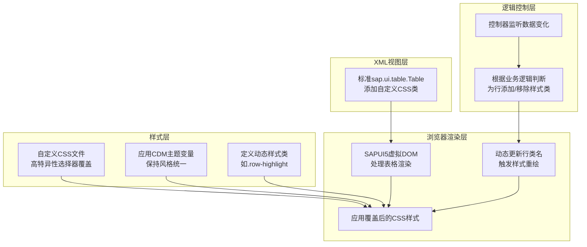

**设计优势与考量**:

1. **性能与稳定性**: 最大程度利用了SAPUI5标准表格控件经过深度优化的虚拟滚动和渲染机制，避免了自研控件可能带来的性能瓶颈和兼容性问题。
2. **开发效率**: 无需从头实现表格的核心逻辑（排序、过滤、列操作、单元格编辑等），只需聚焦于视觉样式的定制，开发成本极低。
3. **可维护性**: 样式与逻辑分离。CSS覆盖易于理解和调整，业务逻辑通过控制器管理，结构清晰。
4. **升级友好**: 对标准控件的侵入性最小。当SAPUI5版本升级时，主要关注点在于其生成的CSS类名是否变化，而非整个控件架构。
5. **功能完整**: 保留了标准表格的所有交互功能，用户熟悉的使用体验得以延续。

**局限性**:

* **深度定制限制**: 对于需要彻底改变表格DOM结构或交互行为的需求（如完全自定义的表头、复杂的单元格合并），纯CSS覆盖可能力不从心，此时可能需要考虑更复杂的扩展方式，如创建自定义的 `Table` 子类并重写其渲染器。但如非必要，应尽量避免此路径。
* **CSS选择器复杂度**: 需要仔细研究SAPUI5为表格生成的HTML结构和CSS类名，以确保覆盖规则准确有效，且不会意外影响其他表格。

---

## 第二章 AI赋能

AI在我这边的定位是**启发**和**代劳**：

1. **启发性AI**：对于有明确目标但缺乏具体实现方案的场景，我会让AI直接生成一个可运行的代码示例。通过研究这个示例，我能在实现过程中快速吸收相关知识，明确技术路径。
2. **代劳性AI**：对于重复性、模式化的编码劳动，或繁琐的样式调试，直接让AI生成代码，从而将时间集中于架构设计和核心逻辑。

该章节将通过具体的例子，直观体现AI如何提升个人开发效率。

### <span id="case-1">1. 关于AI用例的说明</span>

本章旨在通过具体案例，直观展示AI在开发实践中的赋能作用。为了让过程可追溯、方法可借鉴，每个案例都将遵循问题 -> 提示词 -> 结果的清晰结构，完整呈现从需求提出到方案落地的全链路。

我使用的AI模型是Deepseek，涵盖了官网Chat和VSCode中集成的Deepseek API两种形态。需要提前说明的是，真实的开发过程充满探索，往往需要与AI进行多轮对话和反复验证。因此，文档中的对话并非原始的聊天记录拷贝，而是我根据真实场景“复盘”核心问题后，引导AI重新生成的标准化输出。这样做是为了让案例的脉络更清晰，也便于更好地理解和借鉴。

> AI发展很快，在我写文章的时候，又有**Agent Skills**这一概念出来了，本质上还是提示词工程，读者可以自行研究

### <span id="case-2">2. 实现数据大屏框架</span>

**问题背景**:
在启动数据大屏项目前，首先需要确定技术实现方向。经过评估，SAPUI5的标准控件无法满足UI设计稿（PPT效果）中丰富的视觉定制需求。为了避免对标准控件进行复杂的侵入式修改，我决定另起炉灶，构建一套全新的自定义控件框架。这套框架将完全基于自定义控件实现，这意味着我们可以直接借鉴通用的前端开发流程与最佳实践，只需在SAPUI5的开发范式上进行轻量级的适配即可。

#### 2.1 生成静态页面原型

这个步骤的目标是快速验证布局想法，并生成一个可供后续转换为SAPUI5代码的静态HTML原型。

**问题**:
需要一个数据大屏的基础HTML骨架，包含抬头栏和可灵活配置的内容区域。

**提示词**:

```prompt
实现数据大屏（cdm，Custom Data Monitor），要求：
1. 大屏页面包含抬头栏和内容区。
2. 抬头栏分为三个部分：左侧Logo展示，中间页面标题，右侧展示当前时间（动态刷新）。
3. 内容区包含多个子组件，使用CSS Grid Layout进行灵活布局。通过grid-template-areas定义布局模板，子组件通过grid-area属性定位到对应区域。
```

**结果**:

AI生成了一个包含基础结构和样式的静态HTML页面。

<a href="../cdm_resources/chat_response/case-2-1/" target="_blank">查看AI的回复与代码</a>

<a href="../cdm_resources/file/case-2-1.html" target="_blank">静态HTML页面</a>

**效果图**:


**分析与说明**:
这一步的核心是利用AI快速生成UI原型。接下来，我将以此HTML为蓝本，将其转换为SAPUI5的自定义控件代码。

#### <span id="case-2-2">2.2 将原型转换为SAPUI5自定义控件框架</span>

获得静态页面后，下一步是利用AI将其转换为可复用的SAPUI5自定义控件，这是构建整个大屏应用的基石。

**Context Items**（提供给AI的参考文件）:

* <a href="../cdm_resources/file/case-2-1.html" target="_blank">@case-2-1.html</a>: 上一步生成的静态页面原型。
* <a href="../cdm_resources/file/CustomControl.js" target="_blank">@CustomControl.js</a>: SAPUI5自定义控件逻辑的模板文件。
* <a href="../cdm_resources/file/CustomControlRenderer.js" target="_blank">@CustomControlRenderer.js</a>: SAPUI5自定义控件渲染器的模板文件。
* <a href="../cdm_resources/file/custom-style.css" target="_blank">@custom-style.css</a>: 样式文件的模板。

**提示词**:

```prompt
请参考静态页面（ @case-2-1.html ）和提供的SAPUI5模板代码（ @CustomControl.js, @CustomControlRenderer.js, @custom-style.css ），创建以下SAPUI5自定义控件：
1. `Monitor`：作为整个大屏的根容器。
2. `MonitorHeader`：实现页面抬头栏，包含Logo、标题和时间。
3. `MonitorComponent`：代表内容区中的一个可配置子组件。

要求：所有控件的渲染逻辑（生成HTML的部分）必须严格写在对应的Renderer文件中（如`MonitorRenderer.js`），控件js文件（如`Monitor.js`）只负责定义控件属性、事件等元数据。
```

**结果**:

AI根据要求生成了三个SAPUI5自定义控件的核心代码框架。

<a href="../cdm_resources/chat_response/case-2-2/" target="_blank">查看AI的回复与代码</a>

**分析与说明**:
与AI协作是一个迭代调优的过程。本次交互中有两点值得注意：

1. **澄清与修正**：AI首次生成的代码中，部分渲染逻辑错误地写在了控件JS文件里。通过在提示词中强调“渲染代码只需要写在相应renderer文件即可”并重新生成，AI纠正了这个问题，输出了符合SAPUI5最佳实践的代码结构。
2. **控制“自由发挥”**：在生成的`MonitorComponent`代码中，AI可能添加了一些示例属性或注释。如果这些内容不是必需的，需要在提示词中更明确地限制（例如：“不要添加任何示例属性或多余的注释”），以确保生成的代码足够精简。此外，对于非常具体或简单的修改（如“为Monitor控件新增一个名为gridName的属性”），直接手动修改代码通常比通过AI反复生成更高效。

---

### <span id="case-3">3. 自定义控件</span>

**问题背景**:

数据大屏的UI设计稿中包含了许多视觉效果丰富的自定义组件，如时间轴、标签栏、通用卡片等。这些组件在SAPUI5标准库中缺乏直接对应项，需要自行开发。虽然每个组件的具体功能各异，但其开发流程高度相似：**先生成静态HTML/CSS原型进行视觉和交互验证，再将其结构移植到SAPUI5的自定义控件框架中**。本节以“时间轴”控件为例，演示这一通用流程。

#### 3.1 生成静态页面原型

此步骤旨在快速实现并验证时间轴控件的核心视觉和交互效果。

**问题**:

需要一个经典的垂直时间轴，包含时间节点、连接线和内容区，并且条目支持展开/收起以节省空间。

**提示词**:

```prompt
实现一个纯HTML/CSS的时间轴（Timeline），要求：
1.  采用经典的垂直布局，左侧显示时间，右侧显示内容。
2.  每个时间点有清晰的节点图标，上下条目之间有连接线。
3.  条目内容支持展开和收起功能，初始状态为收起。
```

**结果**:

AI生成了一份包含完整结构和样式的静态HTML页面，精确地实现了所要求的时间轴效果。

<a href="../cdm_resources/chat_response/case-3-1/" target="_blank">查看AI的回复与代码</a>

<a href="../cdm_resources/file/case-3-1.html" target="_blank">静态HTML页面</a>

**效果图**:


**分析与说明**:

这一步将抽象的“时间轴”概念具象化为可交互的HTML代码。AI生成的代码为我们提供了可直接参考的视觉样式和交互逻辑（例如，通过 `checkbox` 或 `details` 标签实现展开/收起）。接下来，我们将以此为蓝本，将其封装为可复用的SAPUI5控件。

#### 3.2 将原型转换为SAPUI5自定义控件

获得已验证的静态原型后，下一步是利用SAPUI5的控件框架将其代码化、组件化，以便在项目中复用。

**参考文件**:

* <a href="../cdm_resources/file/case-3-1.html" target="_blank">@case-3-1.html</a>: 上一步生成的时间轴静态原型。
* <a href="../cdm_resources/file/CustomControl.js" target="_blank">@CustomControl.js</a>: SAPUI5自定义控件逻辑的模板。
* <a href="../cdm_resources/file/CustomControlRenderer.js" target="_blank">@CustomControlRenderer.js</a>: SAPUI5自定义控件渲染器的模板。
* <a href="../cdm_resources/file/custom-style.css" target="_blank">@custom-style.css</a>: 样式文件的模板。

**提示词**:

```prompt
请参考静态页面（ @case-3-1.html ）和SAPUI5模板代码（ @CustomControl.js, @CustomControlRenderer.js, @custom-style.css ），创建以下SAPUI5自定义控件：
1.  `Timeline`：作为时间轴的容器。
2.  `TimelineItem`：代表时间轴中的一个条目，包含时间、标题、详细内容，并支持展开/收起功能。

要求：所有控件的渲染逻辑必须写在对应的Renderer文件中，控件JS文件只负责定义元数据（属性、聚合、事件）。
```

**结果**:

AI根据要求，生成了 `Timeline` 和 `TimelineItem` 两个SAPUI5自定义控件的核心代码框架。它将静态HTML的结构拆分到渲染器中，将样式转移到独立的CSS文件中，并定义了控件间的聚合关系（`Timeline` 聚合多个 `TimelineItem`）。

<a href="../cdm_resources/chat_response/case-3-2/" target="_blank">查看AI的回复与代码</a>

**分析与说明**:

这个案例完整地展示了从“设计想法”到“静态原型”，再到“可复用控件”的典型开发路径。与AI协作时，这种分步走的策略非常高效：

1. **快速试错**：先用HTML/CSS快速验证想法，成本极低。
2. **标准化封装**：原型定型后，再引导AI将其转换为符合SAPUI5标准的控件代码。过程中可能需要像[用例2.2](#case-2-2)那样进行1-2轮迭代修正（例如，确保渲染逻辑完全在Renderer中），但这比直接编写控件代码要快得多。

这种模式可以推广到其他所有自定义控件的开发中，例如通用卡片 (`GenericCard`)、标签栏 (`TabBar`) 等，极大地提升了开发效率。

---

### 4. 统一界面风格

随着自定义控件数量的增加，各个组件在AI辅助下独立成型，其视觉风格难免存在差异。为确保整体界面的统一性与专业感，需要通过主题系统对所有组件进行风格整合。

#### 4.1 设计样式主题

**问题背景**：
在控件开发初期，每个组件的样式都是独立设计或由AI按需生成的，缺乏全局的色彩、尺寸和动效规范。为了实现视觉一致性，需要建立一套统一的CSS变量主题，作为所有自定义控件的样式基础。

**提示词**：

```prompt
提供一套科技风格的CSS样式变量，前缀为'cdm-'，包含以下类别：
- 颜色：主色、辅助色、背景色、文本色、边框色
- 尺寸：间距、圆角、字体大小、组件高度
- 阴影：常规阴影、悬浮阴影
- 动画：过渡时间、缓动函数
```

**结果**：

AI生成了一份完整的CSS变量定义文件，覆盖了科技风格数据大屏所需的各类样式参数。

<a href="../cdm_resources/chat_response/case-4-1/" target="_blank">查看AI的回复与代码</a>

<a href="../cdm_resources/file/cdm-tech-theme.css" target="_blank">主题样式文件</a>

<a href="../cdm_resources/file/case-4-1.html" target="_blank">静态HTML页面</a>

**效果图**:


**分析与说明**：

这一步的核心是利用AI快速生成一版结构完整、命名规范的主题方案。开发者无需从零构思每个变量的取值，而是基于AI的初始输出进行微调，大幅降低了主题设计的前期投入。

---

#### 4.2 应用主题至现有组件

**问题背景**：

主题变量定义完成后，需要将其应用到所有已开发的自定义控件中。若手动替换每个CSS文件中的硬编码值，不仅工作量大，且容易遗漏。此处以时间轴控件为例，演示如何借助AI完成主题的批量适配。

**参考文件**：

* <a href="../cdm_resources/file/cdm-tech-theme.css" target="_blank">@cdm-tech-theme.css</a>：已定义好的主题变量
* <a href="../cdm_resources/file/case-3-1.html" target="_blank">@case-3-1.html</a>：时间轴控件的静态原型（用于验证样式效果）

**提示词**：

```prompt
调整组件代码（ @EchartContainerWithoutTheme.js ），基于目前已存在的CSS样式（ @cdm-variables.css ），生成一个完整的ECharts主题配置对象，要求：
1. 参考Echart主题的可配置项（ @echart-cdm-theme ），将里面的可配置项都替换为对应的CSS变量
```

**结果**：

AI生成了适配主题后的时间轴组件代码，原有的固定数值被替换为`var(--cdm-*)`形式的CSS变量引用。

<a href="../cdm_resources/chat_response/case-4-2/" target="_blank">查看AI的回复与代码</a>

<a href="../cdm_resources/file/case-4-2.html" target="_blank">适配主题后的静态HTML页面</a>

**效果图**:


**分析与说明**：

这一步骤充分发挥了AI在模式化任务中的优势——将繁琐的变量替换工作交由AI处理，开发者仅需核对最终效果是否符合预期。同样的方法可以快速应用于`GenericCard`、`TabBar`等其他控件，确保整个大屏的视觉风格高度统一。

---

---

### <span id="case-5">5. ECharts 主题</span>

**问题背景**：
在数据大屏中，ECharts 图表的视觉风格需要与基于 CSS 变量构建的整体 UI 主题保持严格一致。然而，ECharts 的主题配置项繁多，手动对齐成本高且容易出错。因此，我们需要借助 AI 来高效地完成这一任务。

#### 5.1 生成主题配置原型

**目标**：快速生成一个与 CDM 主题系统对齐的 ECharts 主题配置 JSON 文件，用于初步预览效果。

**参考文件**：

* <a href="../cdm_resources/file/cdm-variables.css" target="_blank">@cdm-variables.css</a>：项目已定义好的 CSS 主题变量
* <a href="../cdm_resources/file/echart-theme-config.json.txt" target="_blank">@echart-theme-config.json</a>：从 ECharts 官方导出的主题配置模板文件

**提示词**：

```prompt
请参考 @cdm-variables.css 中定义的 CSS 变量，将 @echart-theme-config.json 模板中的可配置项都替换为已设定好的具体颜色值。
```

**结果**：
AI 生成了一个以 CSS 变量形式引用的 ECharts 主题配置文件。

* <a href="../cdm_resources/chat_response/case-5-1/" target="_blank">查看 AI 的回复与代码</a>

**效果图**：

将AI生成的配置文件重新上传，预览实际效果


#### 5.2 适配项目可用的主题文件

**目标**：将上一步生成的、包含 CSS 变量的主题配置，转换为 ECharts 可以直接解析的纯 JSON 格式，以便在项目中实际加载使用。

**参考文件**：

* <a href="../cdm_resources/file/cdm-variables.css" target="_blank">@cdm-variables.css</a>：项目已定义好的 CSS 主题变量
* <a href="../cdm_resources/file/echart-theme.json.txt" target="_blank">@echart-theme.json</a>：从 ECharts 官网下载的主题 JSON 文件（非导出，格式不同）

**提示词**：

```prompt
请参考 @cdm-variables.css 中的 CSS 变量值，将 @echart-theme.json 中的可配置项，替换为对应的参数变量（如 `var(--cdm-color-primary)`）。
```

**结果**：
AI 生成了一个 ECharts 可直接使用的 JSON 主题文件。

* <a href="../cdm_resources/chat_response/case-5-2/" target="_blank">查看 AI 的回复与代码</a>

#### 5.3 运行时动态生成主题

**目标**：解决 ECharts 在运行时无法直接解析 CSS 变量的问题。我们需要在 JavaScript 代码中，将 CSS 变量动态解析为具体像素值，然后生成主题配置对象。

**参考文件**：

* <a href="../cdm_resources/file/EchartContainer.js" target="_blank">@EchartContainer.js</a>：尚未实现主题动态解析功能的 ECharts 容器控件代码。

**提示词**：

```prompt
ECharts 的主题配置中使用了 var() 函数，这在运行时不会生效。请修改 @EchartContainer.js 中的代码，在初始化 ECharts 实例前，通过 JavaScript 获取页面根元素的计算样式，将主题配置中的所有 CSS 变量（如 `var(--cdm-color-primary)`）解析为实际的 RGB 或颜色字符串值，再传递给 ECharts。
```

**结果**：
AI 调整了组件代码，使其能在运行时动态解析 CSS 变量，生成可用的主题配置。

* <a href="../cdm_resources/chat_response/case-5-3/" target="_blank">查看 AI 的回复与代码</a>

**效果图**：

将AI应用的代码部署到项目上，Echart图表效果如下：


---

### <span id="case-6">6. 粒子系统</span>

**问题背景**：
为增强数据大屏的视觉冲击力，希望在静态背景基础上，加入动态的粒子飘浮效果。

**参考文件**：

* <a href="../cdm_resources/file/MonitorBackground.js" target="_blank">@MonitorBackground.js</a> 基础背景组件
* <a href="../cdm_resources/file/MonitorBackgroundRenderer.js" target="_blank">@MonitorBackgroundRenderer.js</a> 配套渲染器

**提示词**：

```prompt
继承 MonitorBackground 控件，编写一个粒子飘浮的背景组件，以增强界面的视觉效果。
```

**结果**：

AI 生成了 `ParticleBackground` 控件及其渲染器的核心代码。

<a href="../cdm_resources/chat_response/case-6-1/" target="_blank">查看AI的回复与代码</a>

**应用示例**：

在 XML 视图中，将粒子背景作为 `Monitor` 的一个背景层添加：

```xml
<cus:Monitor id="id_Demo_Monitor">
    <cus:backgrounds>
        <cus:MonitorBackground
            backgroundColor="#0b1127"
            zIndex="-9999" />
        <cus:ParticleBackground
            id="id_Demo_ParticleBackground"
            zIndex="9999" />
    </cus:backgrounds>
</cus:Monitor>
```

**效果图**：


**分析与说明**：

AI 生成的控件主体逻辑（`ParticleBackground.js`）可直接使用，但在渲染器（`ParticleBackgroundRenderer.js`）部分存在偏差。由于受“继承”这一表述的影响，AI 尝试复用基类渲染器，导致生成的 DOM 结构不匹配实际布局需求。经手动调整后，渲染器被修正为独立生成容器与画布，并正确应用了 `zIndex` 与 `pointer-events` 等属性，最终实现了预期的视觉效果。

修正代码如下：

```javascript

sap.ui.define([
    "cdm/ui/control/MonitorBackgroundRenderer"
], function (MonitorBackgroundRenderer) {
    "use strict";

    var ParticleBackgroundRenderer = Object.assign({}, MonitorBackgroundRenderer);

    ParticleBackgroundRenderer.render = function (rm, oControl) {
        // 原渲染代码无法复用，直接移除
        // MonitorBackgroundRenderer.render(rm, oControl);
        
        // 改为获取自身组件ID
        var sId = oControl.getId();
        
        // Canvas外新增一层div用于隔绝基础框架的布局影响
        // 同时将样式设置移到该DIV下
        rm.openStart("div", sId)
            .class("cdm-particle-container")
            .style("position", "absolute")
            .style("top", "0")
            .style("left", "0")
            .style("width", "100%")
            .style("height", "100%")
            .style("z-index", oControl.getZIndex() + 1)
            .style("pointer-events", oControl.getInteractive() ? "auto" : "none")
            .openEnd();
        
        // 渲染粒子画布
        rm.openStart("canvas", sId + "-particleCanvas")
            .class("cdm-particle-canvas");
        rm.openEnd();
        rm.close("canvas");

        rm.close("div");
    };

    return ParticleBackgroundRenderer;
});

```

---

### <span id="case-7">7. 单页面模拟多页面切换</span>

**问题背景**：
在单个屏幕内需要展示多个页面内容，通过模拟水平切换效果，实现类似多页面浏览的交互体验。

#### 7.1 生成第一版代码

**参考文件**：

* <a href="../cdm_resources/file/Monitor.js" target="_blank">@Monitor.js</a>
* <a href="../cdm_resources/file/MonitorRenderer.js" target="_blank">@MonitorRenderer.js</a>
* <a href="../cdm_resources/file/Home.view.xml" target="_blank">@Home.view.xml</a>
* <a href="../cdm_resources/file/Home.controller.js" target="_blank">@Home.controller.js</a>

**提示词**：

```prompt
基于SAPUI5自定义控件模板（ @Monitor.js @MonitorRenderer.js ），设计一个新的自定义控件：

1. 该控件用于在单页面中模拟多页面水平切换
2. 控件内容为多个页面（ sap.ui.core.mvc.View ）
3. 通过样式类 CdmView、CdmViewShow、CdmViewHide 控制页面切换
4. 支持自动切换，同时提供半透明按钮或悬停时显示的按钮用于手动切换
5. 参考视图示例（ @Home.view.xml ）和控制器代码（ @Home.controller.js ）
```

**结果**：
AI 生成了 `MonitorViewSwitcher` 控件及其渲染器的核心代码。

<a href="../cdm_resources/chat_response/case-7-1/" target="_blank">查看AI的回复与代码</a>

**分析与调整**：
AI 生成的控件主体逻辑可直接使用，但渲染器代码存在偏差。由于受“继承”表述影响，AI 尝试复用基类渲染器，导致 DOM 结构不符合布局需求。经手动调整，渲染器改为独立生成容器与画布，并正确配置 `zIndex` 与 `pointer-events` 等属性，最终达到预期视觉效果。

修正后的渲染器代码如下：

```javascript
sap.ui.define([
    "cdm/ui/control/MonitorBackgroundRenderer"
], function (MonitorBackgroundRenderer) {
    "use strict";

    var ParticleBackgroundRenderer = Object.assign({}, MonitorBackgroundRenderer);

    ParticleBackgroundRenderer.render = function (rm, oControl) {
        var sId = oControl.getId();
        
        rm.openStart("div", sId)
            .class("cdm-particle-container")
            .style("position", "absolute")
            .style("top", "0")
            .style("left", "0")
            .style("width", "100%")
            .style("height", "100%")
            .style("z-index", oControl.getZIndex() + 1)
            .style("pointer-events", oControl.getInteractive() ? "auto" : "none")
            .openEnd();
        
        rm.openStart("canvas", sId + "-particleCanvas")
            .class("cdm-particle-canvas");
        rm.openEnd();
        rm.close("canvas");

        rm.close("div");
    };

    return ParticleBackgroundRenderer;
});
```

#### 7.2 根据实际效果进行调整

**参考文件**：

* <a href="../cdm_resources/file/MonitorViewSwitcher.js" target="_blank">@MonitorViewSwitcher.js</a> 前面生成的代码

**提示词**：

```prompt
@MonitorViewSwitcher.js

为了让页面切换更加符合直觉和沉浸体验，应该采用三段式样式变化，实现以下页面变化：

1. 切换到下一页
   旧页： cdm-view-show -> cdm-view-hide-left -> cdm-view-hide 
   新页： cdm-view-hide -> cdm-view-hide-right -> cdm-view-show

2. 切换到上一页
   旧页： cdm-view-show -> cdm-view-hide-right -> cdm-view-hide 
   新页： cdm-view-hide -> cdm-view-hide-left -> cdm-view-show
```

**结果**：
AI 更新了 `MonitorViewSwitcher` 控件的页面切换逻辑，实现了三段式样式变化。

<a href="../cdm_resources/chat_response/case-7-2/" target="_blank">查看AI的回复与代码</a>

**最终效果图**：


> 注：为便于演示，视频中采用按钮点击方式触发切换，实际环境中为自动切换。

---

## 附录

### 名称认识

* **`cdm`**：**Custom Data Monitor**（自定义数据监控大屏）。

### 项目文件

[项目文件](./cdm_resources/file/cdm-2026-03-260228.zip)
