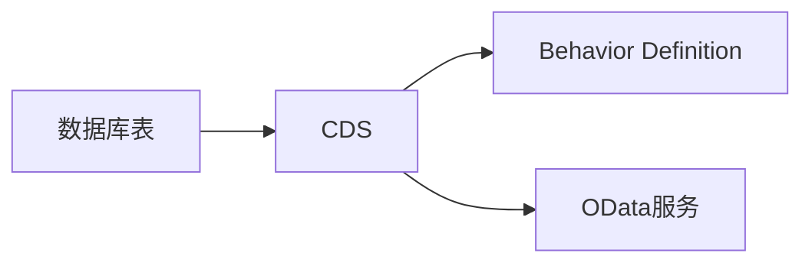
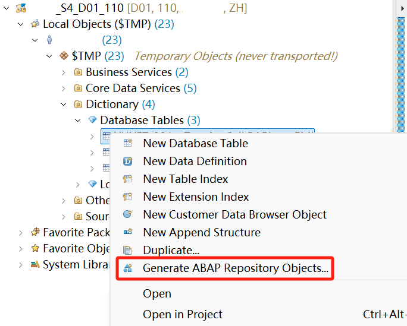
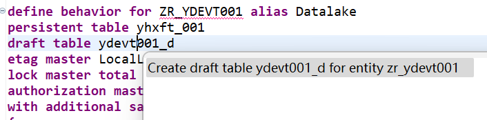

# RAP开发流程

以物料创建为例子，演示下RAP开发流程

## 开发流程图



现在Eclipse里可以一键生成上面的对象了，实际开发只需要集中在取值和行为就行。

## 新建数据库表

定义数据库表：

<details open>
  <summary>示例代码</summary>

```SQL
@EndUserText.label : 'RAP Demo'
@AbapCatalog.enhancement.category : #NOT_EXTENSIBLE
@AbapCatalog.tableCategory : #TRANSPARENT
@AbapCatalog.deliveryClass : #A
@AbapCatalog.dataMaintenance : #RESTRICTED
define table ydemot001 {

  key client            : abap.clnt not null;
  // UUID，如无特殊要求，都建议表主键只用UUID，因为能托管给系统自动创建ID
  key uuid              : sysuuid_x16 not null;
  // 物料编码
  product               : matnr;
  // 物料名称
  product_name          : maktx;
  // 处理状态，数据存在分步处理的情况，通过处理状态控制
  status                : abap.char(1);
  // 处理结果
  mtype                 : bapi_mtype;
  // 消息文本
  msg                   : bapi_msg;
  // Behavior Definition常用参数
  local_last_changed_at : abp_locinst_lastchange_tstmpl;
  local_last_changed_by : abp_locinst_lastchange_user;
  last_changed_at       : abp_lastchange_tstmpl;
  last_changed_by       : abp_lastchange_user;

}
```

</details>

## 创建服务

以前还要手工建CDS，Behavior Definition，Service Definition，Service Binding，现在可以一键创建：



## 微调CDS

判断物料创建是否成功，还是查表比较靠谱，所以微调下CDS：

<details open>
  <summary>关联MARA检查物料是否创建</summary>

```SQL hl_lines="13 14 15 16 17"
@AccessControl.authorizationCheck: #CHECK
@EndUserText.label: '##GENERATED YDEMOT001'
define root view entity ZR_YDEMOT001
  as select from    ydemot001   as Datalake
    left outer join mara as mara on Datalake.product = mara.matnr
{
  key Datalake.uuid                  as UUID,
      Datalake.product               as Product,
      Datalake.product_name          as ProductName,
      Datalake.status                as Status,
      Datalake.mtype                 as Mtype,
      Datalake.msg                   as Msg,
      // 检查SAP是否已存在物料
      case when mara.matnr is null
        then '' // 未创建
        else 'X' // 已创建
      end                            as ErpCreated,
      @Semantics.systemDateTime.localInstanceLastChangedAt: true
      Datalake.local_last_changed_at as LocalLastChangedAt,
      @Semantics.user.localInstanceLastChangedBy: true
      Datalake.local_last_changed_by as LocalLastChangedBy,
      @Semantics.systemDateTime.lastChangedAt: true
      Datalake.last_changed_at       as LastChangedAt,
      @Semantics.user.lastChangedBy: true
      Datalake.last_changed_by       as LastChangedBy

}
```

</details>

## 微调Behavior Definition

首先修改Draft Table，光标放在草稿表上，快捷键Ctrl+F1，选择重建：


然后微调下面高亮部分：

- 新增 **action: CreateErpProduct**
- 新增 **with additional save**，用于触发 **save_modify**
- 注释mapping里的字段，将这部分字段从托管改为手工处理

<details open>
  <summary>示例代码</summary>

```SQL hl_lines="11 23 38 39 40 41 42 43"
managed implementation in class ZBP_YDEMOT001 unique;
strict ( 2 );
with draft;

define behavior for ZR_YDEMOT001 alias Datalake
persistent table ydemot001
draft table zydemot001_d
etag master LocalLastChangedAt
lock master total etag LastChangedAt
authorization master ( global )
with additional save
{
  field ( readonly )
  UUID,
  LastChangedAt,
  LastChangedBy,
  LocalLastChangedAt,
  LocalLastChangedBy;

  field ( numbering : managed )
  UUID;

  action CreateErpProduct result [1] $self;

  create;
  update;
  delete;

  draft action Edit;
  draft action Activate optimized;
  draft action Discard;
  draft action Resume;
  draft determine action Prepare;

  mapping for ydemot001
    {
      UUID               = uuid;
      // 涉及API调用，下面字段在save_modify方法中手工处理，而不是托管
      //      Product            = product;
      //      ProductName        = product_name;
      //      Status             = status;
      //      Mtype              = mtype;
      //      Msg                = msg;
      LocalLastChangedAt = local_last_changed_at;
      LocalLastChangedBy = local_last_changed_by;
      LastChangedAt      = last_changed_at;
      LastChangedBy      = last_changed_by;
    }
}
```

</details>

## 修改行为类

新增消息类，替代以前直接Message报错

<details>
  <summary>消息类</summary>

```ABAP
CLASS lcl_abap_behv_msg DEFINITION CREATE PUBLIC INHERITING FROM cx_no_check.
  PUBLIC SECTION.

    INTERFACES if_abap_behv_message .

    ALIASES msgty
      FOR if_t100_dyn_msg~msgty .
    ALIASES msgv1
      FOR if_t100_dyn_msg~msgv1 .
    ALIASES msgv2
      FOR if_t100_dyn_msg~msgv2 .
    ALIASES msgv3
      FOR if_t100_dyn_msg~msgv3 .
    ALIASES msgv4
      FOR if_t100_dyn_msg~msgv4 .

    METHODS constructor
      IMPORTING
        !textid   LIKE if_t100_message=>t100key OPTIONAL
        !previous LIKE previous OPTIONAL
        !msgty    TYPE symsgty OPTIONAL
        !msgv1    TYPE simple OPTIONAL
        !msgv2    TYPE simple OPTIONAL
        !msgv3    TYPE simple OPTIONAL
        !msgv4    TYPE simple OPTIONAL .

    CLASS-METHODS new_message_with_text
      IMPORTING !severity  TYPE if_abap_behv_message=>t_severity  DEFAULT if_abap_behv_message=>severity-error
                !text      TYPE csequence OPTIONAL
      RETURNING VALUE(obj) TYPE REF TO if_abap_behv_message.

ENDCLASS.

CLASS lcl_abap_behv_msg IMPLEMENTATION.

  METHOD constructor.
    CALL METHOD super->constructor EXPORTING previous = previous.
    me->msgty = msgty .
    me->msgv1 = msgv1 .
    me->msgv2 = msgv2 .
    me->msgv3 = msgv3 .
    me->msgv4 = msgv4 .
    CLEAR me->textid.
    IF textid IS INITIAL.
      if_t100_message~t100key = if_t100_message=>default_textid.
    ELSE.
      if_t100_message~t100key = textid.
    ENDIF.
  ENDMETHOD.

  METHOD new_message_with_text.

    obj = NEW lcl_abap_behv_msg(
      textid = VALUE #(
                 msgid = 'SABP_BEHV'
                 msgno = '100'
                 attr1 = COND #( WHEN text IS NOT INITIAL THEN 'IF_T100_DYN_MSG~MSGV1' )
    )
      msgty = SWITCH #( severity
                WHEN if_abap_behv_message=>severity-error       THEN 'E'
                WHEN if_abap_behv_message=>severity-warning     THEN 'W'
                WHEN if_abap_behv_message=>severity-information THEN 'I'
                WHEN if_abap_behv_message=>severity-success     THEN 'S' )
      msgv1 = |{ text }|
    ).
    obj->m_severity = severity.

  ENDMETHOD.

ENDCLASS.
```

</details>

由于这个示例是模拟“用户点击创建按钮生成物料”操作，且Action存在某些限制，导致具体处理只能移到save_modify。

为了处理这种多步操作，程序通过以下处理状态判断：

| 状态 | 描述       |
|------|------------|
| 空   | 初始数据   |
| R    | 待处理     |
| P    | 处理中     |
| F    | 处理完成   |

<details open>
  <summary>处理状态常量</summary>

```abap
CLASS lcl_constant DEFINITION.
  PUBLIC SECTION.
    CONSTANTS:
      BEGIN OF cns_process_status,
        initial    VALUE '',
        ready      VALUE 'R',
        processing VALUE 'P',
        finish     VALUE 'F',
        error      VALUE 'E',
      END OF cns_process_status.
ENDCLASS.
```

</details>

通过cl_abap_behavior_handler响应Action操作：

<details>
  <summary>响应CreateErpProdcut操作</summary>

```ABAP
CLASS lhc_datalake DEFINITION INHERITING FROM cl_abap_behavior_handler.
  PRIVATE SECTION.
    METHODS:
      get_global_authorizations FOR GLOBAL AUTHORIZATION
        IMPORTING
        REQUEST requested_authorizations FOR datalake
        RESULT result.
    METHODS createerpproduct FOR MODIFY
      IMPORTING keys FOR ACTION datalake~createerpproduct RESULT result.
ENDCLASS.

CLASS lhc_datalake IMPLEMENTATION.
  METHOD get_global_authorizations.
  ENDMETHOD.

  METHOD createerpproduct.

    " 读取要创建物料的条目
    READ ENTITIES OF zr_ydemot001 IN LOCAL MODE
      ENTITY datalake ALL FIELDS WITH CORRESPONDING #( keys )
      RESULT DATA(lt_datalake).

    DATA lt_update TYPE TABLE FOR UPDATE zr_ydemot001.
    DATA lv_msg TYPE string.

    LOOP AT lt_datalake REFERENCE INTO DATA(lr_datalake).
      IF lr_datalake->status IS NOT INITIAL.
        "
        CASE lr_datalake->status.
          WHEN lcl_constant=>cns_process_status-ready.
            " 已经是准备状态了，不用报错也不用继续设置状态
          WHEN lcl_constant=>cns_process_status-processing.
            lv_msg = '数据处理中，不允许重复处理'.
          WHEN lcl_constant=>cns_process_status-finish.
            lv_msg = '数据已处理，不允许重复处理'.
          WHEN lcl_constant=>cns_process_status-error.
            " 已处理，但处理异常，允许重复处理
          WHEN OTHERS.
            lv_msg = '数据状态异常'.
        ENDCASE.

        "
        IF lv_msg IS NOT INITIAL.
          " 新建消息区域
          INSERT VALUE #(
              %tky        = lr_datalake->%tky
              %state_area = 'STATUS_CHECK'
          ) INTO TABLE reported-datalake.
          " 展示错误消息
          INSERT VALUE #( %tky = lr_datalake->%tky ) INTO TABLE failed-datalake.
          INSERT VALUE #( %tky        = lr_datalake->%tky
                          %state_area = 'STATUS_CHECK'
                          %msg        = lcl_abap_behv_msg=>new_message_with_text( severity = if_abap_behv_message=>severity-error
                                                                                  text     = '数据处理中，不允许重复处理' )
          ) INTO TABLE reported-datalake.
          CONTINUE.
        ENDIF.
      ENDIF.

      IF lr_datalake->erpcreated = abap_true.
        " 新建消息区域
        INSERT VALUE #(
            %tky        = lr_datalake->%tky
            %state_area = 'CREATED_CHECK'
        ) INTO TABLE reported-datalake.
        " 展示错误消息
        INSERT VALUE #( %tky = lr_datalake->%tky ) INTO TABLE failed-datalake.
        INSERT VALUE #( %tky        = lr_datalake->%tky
                        %state_area = 'CREATED_CHECK'
                        %msg        = lcl_abap_behv_msg=>new_message_with_text( severity = if_abap_behv_message=>severity-error
                                                                                text     = 'ERP已创建该物料，请勿重复创建' )
        ) INTO TABLE reported-datalake.
        CONTINUE.
      ENDIF.

      INSERT CORRESPONDING #( lr_datalake->* ) INTO TABLE lt_update REFERENCE INTO DATA(lr_update).
      " 切换到待处理状态
      lr_update->status = lcl_constant=>cns_process_status-ready.
      CLEAR lr_update->mtype.
      CLEAR lr_update->msg.
    ENDLOOP.

    " 更新数据状态，在后续save_modify处理中，会根据状态判断是否执行创建物料操作
    MODIFY ENTITIES OF zr_ydemot001 IN LOCAL MODE
        ENTITY datalake
            UPDATE FIELDS ( product status mtype msg ) WITH lt_update
        FAILED failed
        REPORTED reported.

    " 再次读取数据返回前端显示
    READ ENTITIES OF zr_ydemot001 IN LOCAL MODE
      ENTITY datalake ALL FIELDS WITH CORRESPONDING #( keys )
      RESULT DATA(lt_result).
    result = VALUE #( FOR ls IN lt_result ( %tky   = ls-%tky
                                            %param = ls ) ).

  ENDMETHOD.

ENDCLASS.

```

</details>

通过继承cl_abap_behavior_saver来重写save_modified：

<details>
  <summary>重写save_modified</summary>

```ABAP

CLASS lsc_zr_ydemot001 DEFINITION INHERITING FROM cl_abap_behavior_saver.
  PROTECTED SECTION.
    METHODS save_modified REDEFINITION.
ENDCLASS.

CLASS lsc_zr_ydemot001 IMPLEMENTATION.
  METHOD save_modified.

    DATA lt_datalake TYPE TABLE FOR READ RESULT zr_ydemot001.

    IF create-datalake IS NOT INITIAL.
      " Provide table of instance data of all instances that have been created during current transaction
      " Use %CONTROL to get information on what entity fields have been set or updated during the current transaction
    ENDIF.

    IF update-datalake IS NOT INITIAL.
      " Provide table of instance data of all instances that have been updated during current transaction
      " Use %CONTROL to get information on what entity fields have been updated

      " 取待处理数据
      lt_datalake = CORRESPONDING #( update-datalake ).
      DELETE lt_datalake WHERE status <> lcl_constant=>cns_process_status-ready.
      " 状态更新为处理中
      LOOP AT lt_datalake REFERENCE INTO DATA(lr_datalake).
        lr_datalake->status = lcl_constant=>cns_process_status-processing.
      ENDLOOP.
      " 数据处理
      NEW ycl_clean_core_demo( )->cerate_product( CHANGING ct_datalake = lt_datalake ).
      " 回写状态
      LOOP AT lt_datalake REFERENCE INTO lr_datalake.
        IF lr_datalake->mtype = 'S'.
          lr_datalake->status = lcl_constant=>cns_process_status-finish.
        ELSE.
          CLEAR lr_datalake->product.
          lr_datalake->status = lcl_constant=>cns_process_status-error.
          IF lr_datalake->mtype IS INITIAL.
            lr_datalake->mtype = 'E'.
          ENDIF.
          IF lr_datalake->msg IS INITIAL.
            lr_datalake->msg = '创建物料失败'.
          ENDIF.
        ENDIF.
        UPDATE ydemot001 SET
          product = @lr_datalake->product,
          status = @lr_datalake->status,
          mtype = @lr_datalake->mtype,
          msg = @lr_datalake->msg
        WHERE uuid = @lr_datalake->uuid.
      ENDLOOP.

    ENDIF.

    IF delete-datalake IS NOT INITIAL.
      " Provide table with keys of all instances that have been deleted during current transaction
      " Use %CONTROL to get information on what entity fields have been updated
    ENDIF.

  ENDMETHOD.
ENDCLASS.
```

</details>

## 创建物料

研究了几种创建物料的方法，结合自定义BO使用，仅推荐调用公共API这一种方法：

| 创建方式         | 说明                                                                 |
|------------------|----------------------------------------------------------------------|
| EML              | 最后一步提交涉及COMMIT操作，无法在BO内嵌套使用                                   |
| 内部API          | 由于资料太少，推测是SAP内部使用的API                                 |
| 公共接口（A2X）  | 公共接口，通常用于外围系统访问，在BO内可以通过CREATE_V2_LOCAL_PROXY方式模拟接口调用<br>应该是最合适Clean Core的方式 |
| 公共接口（V4）| 调用方法类比A2X，换成V4即可<br>测试发现，执行请求后会出现COMMIT/ROLLBACK操作，无法在BO内使用 |

<details>
  <summary>示例代码</summary>

```ABAP

CLASS ycl_clean_core_demo DEFINITION
  PUBLIC
  FINAL
  CREATE PUBLIC .

  PUBLIC SECTION.

    TYPES:
      BEGIN OF ty_datalake,
        BEGIN OF product,
          entities TYPE TABLE FOR READ RESULT zr_ydemot001,
          failed   TYPE TABLE FOR FAILED LATE zr_ydemot001,
          reported TYPE TABLE FOR REPORTED LATE zr_ydemot001,
        END OF product,
      END OF ty_datalake.

    METHODS: cerate_product CHANGING ct_datalake TYPE ty_datalake-product-entities.


  PROTECTED SECTION.
  PRIVATE SECTION.
    METHODS: cerate_product_eml CHANGING ct_datalake TYPE ty_datalake-product-entities.
    METHODS: cerate_product_api CHANGING ct_datalake TYPE ty_datalake-product-entities.
    METHODS: cerate_product_a2x CHANGING ct_datalake TYPE ty_datalake-product-entities.
    METHODS: cerate_product_odata_v4 CHANGING ct_datalake TYPE ty_datalake-product-entities.
    METHODS: _write_error IMPORTING iv_msg      TYPE bapi_msg
                          CHANGING  ct_datalake TYPE ty_datalake-product-entities.
ENDCLASS.


CLASS ycl_clean_core_demo IMPLEMENTATION.

  METHOD cerate_product.

*    " EML方式创建物料，由于Behavior不能嵌套Behavior操作，所以执行会Dump
*    cerate_product_eml( CHANGING ct_datalake = ct_datalake ).

    " 内部API方式创建物料
    cerate_product_api( CHANGING ct_datalake = ct_datalake ).

*    " 模拟调用公共接口（A2X）创建物料议
*    cerate_product_a2x( CHANGING ct_datalake = ct_datalake ).

*    " 模拟调用公共接口（V4）创建物料议
*    " 无解，V4执行后会COMMIT/ROLLBACK，这导致DUMP，得找SAP问问
*    cerate_product_odata_v4( CHANGING ct_datalake = ct_datalake ).

  ENDMETHOD.


  METHOD cerate_product_eml.
*&---------------------------------------------------------------------*
*& 使用EML方式创建物料，可用，但不能在BO内嵌套使用
*&---------------------------------------------------------------------*
    DATA:
      lt_product      TYPE TABLE FOR CREATE r_producttp,
      ls_product      LIKE LINE OF lt_product,
      lt_product_desc TYPE TABLE FOR CREATE r_producttp\_productdescription,
      ls_product_desc LIKE LINE OF lt_product_desc.
    DATA lv_has_error.

*&---------------------------------------------------------------------*
*& 数据填充
*&---------------------------------------------------------------------*
    LOOP AT ct_datalake REFERENCE INTO DATA(lr_datalake).
      " 设置临时编号并不能自动流水，核心是S_TEMP_NUM字段
      IF lr_datalake->product IS INITIAL.
        lr_datalake->product = |%{ sy-tabix }|.
      ENDIF.
*&---------------------------------------------------------------------*
*& 物料基础视图
*&---------------------------------------------------------------------*
      CLEAR ls_product.
      ls_product-%cid = lr_datalake->uuid.

      ls_product-product = lr_datalake->product.
      ls_product-%control-product = if_abap_behv=>mk-on.

      ls_product-industrysector = 'M'. " 机械工程
      ls_product-%control-industrysector = if_abap_behv=>mk-on.

      ls_product-producttype = 'FERT'. " 成品
      ls_product-%control-producttype = if_abap_behv=>mk-on.

      ls_product-baseunit = 'EA'. "
      ls_product-%control-baseunit = if_abap_behv=>mk-on.

      INSERT ls_product INTO TABLE lt_product.

*&---------------------------------------------------------------------*
*& 物料描述
*&---------------------------------------------------------------------*
      CLEAR ls_product_desc.
      ls_product_desc-%cid_ref = lr_datalake->uuid.
      ls_product_desc-product = lr_datalake->product.

      DATA ls_product_desc_target LIKE LINE OF ls_product_desc-%target.
      CLEAR ls_product_desc_target.
      ls_product_desc_target-%cid = |{ lr_datalake->uuid }-desc1|.

      ls_product_desc_target-product = lr_datalake->product.
      ls_product_desc_target-%control-product = if_abap_behv=>mk-on.

      ls_product_desc_target-language = '1'.
      ls_product_desc_target-%control-language = if_abap_behv=>mk-on.

      ls_product_desc_target-productdescription = lr_datalake->productname.
      ls_product_desc_target-%control-productdescription = if_abap_behv=>mk-on.

      INSERT ls_product_desc_target INTO TABLE ls_product_desc-%target.
      INSERT ls_product_desc INTO TABLE lt_product_desc.
    ENDLOOP.

*&---------------------------------------------------------------------*
*& 调用EML
*&---------------------------------------------------------------------*
    " 用EML方式触发Behavior来创建物料
    MODIFY ENTITIES OF r_producttp
        ENTITY product
            CREATE FROM lt_product
            " 对于子结构，Product字段为只读字段，所以只能将列全部列出，不能用省略的写法
            " CREATE BY \_productdescription FROM lt_product_desc
            CREATE BY \_productdescription FIELDS ( language productdescription ) WITH lt_product_desc
        MAPPED DATA(create_mapped)
        FAILED DATA(create_failed)
        REPORTED DATA(create_reported).

    " 前置校验处理
    IF create_failed IS NOT INITIAL.
      LOOP AT ct_datalake REFERENCE INTO lr_datalake.
        lr_datalake->mtype = 'E'.
        LOOP AT create_reported-product INTO DATA(ls_create_reported).
          lr_datalake->msg = |{ lr_datalake->msg }{ ls_create_reported-%msg->if_message~get_text( ) };|.
        ENDLOOP.
      ENDLOOP.
    ENDIF.

    " 模拟创建
    " 开启异步调试，系统调试，断点打CL_CMD_PROD_RAP_HANDLER~VALIDATE_PRODUCT方法
    " 在调试中，设置api_data_t-s_temp_num=X，就能自动给号了
    COMMIT ENTITIES IN SIMULATION MODE
        RESPONSE OF r_producttp
        FAILED DATA(simulation_failed)
        REPORTED DATA(simulation_reported).

    " 模拟创建结果处理
    IF simulation_failed IS NOT INITIAL.
      LOOP AT ct_datalake REFERENCE INTO lr_datalake.
        lr_datalake->mtype = 'E'.
        LOOP AT simulation_reported-product INTO DATA(ls_simulation_reported).
          lr_datalake->msg = |{ lr_datalake->msg }{ ls_simulation_reported-%msg->if_message~get_text( ) };|.
        ENDLOOP.
      ENDLOOP.
      RETURN.
    ENDIF.

    " 正式创建
    " 有点奇怪，模拟似乎也会占用流水
    COMMIT ENTITIES
        RESPONSE OF r_producttp
        FAILED DATA(commit_failed)
        REPORTED DATA(commit_reported).

    " 正式创建结果处理
    LOOP AT ct_datalake REFERENCE INTO lr_datalake.
      IF commit_failed IS NOT INITIAL.
        lr_datalake->mtype = 'E'.
        LOOP AT commit_reported-product INTO DATA(ls_commit_reported).
          lr_datalake->msg = |{ lr_datalake->msg }{ ls_commit_reported-%msg->if_message~get_text( ) };|.
        ENDLOOP.
      ELSE.
        lr_datalake->mtype = 'S'.
        lr_datalake->msg = |物料创建成功|.
        " 由于物料EML只能外部给号，这里回写并没有意义
*        DATA(lv_matnr) = create_mapped-product[ %cid = lr_datalake->uuid ]-product.
*        lr_datalake->msg = |物料创建成功，编号: { lv_matnr }|.
      ENDIF.
    ENDLOOP.

  ENDMETHOD.


  METHOD cerate_product_api.
*&---------------------------------------------------------------------*
*& 使用内部API（cl_cmd_prod_data_api）创建物料，代码类似以前的BAPI
*&---------------------------------------------------------------------*
    DATA: lt_unified_api_data TYPE cmd_prd_t_unified_prod_data,
          ls_unified_api_data TYPE cmd_prd_s_unified_prod_data,
          lt_prodwise_output  TYPE cl_cmd_prod_data_api=>if_cmd_product_maint_api~tt_pmd_output,
          lv_has_error        TYPE boole_d VALUE abap_false,
          lv_product          TYPE productnumber,
          lv_mtype            TYPE bapi_mtype,
          lv_msg              TYPE bapi_msg.

*&---------------------------------------------------------------------*
*& 数据填充
*&---------------------------------------------------------------------*
    LOOP AT ct_datalake REFERENCE INTO DATA(lr_datalake).
      CLEAR ls_unified_api_data.

      " 对于非外部给号物料，需设置S_TEMP_NUM=X
      IF lr_datalake->product IS INITIAL.
        lr_datalake->product = |%{ sy-tabix }|.
        ls_unified_api_data-s_temp_num = abap_true.
      ENDIF.

*&---------------------------------------------------------------------*
*& 物料基础视图
*&---------------------------------------------------------------------*
      ls_unified_api_data-product-product = lr_datalake->product.
      ls_unified_api_data-product-productdescription = lr_datalake->productname.
      ls_unified_api_data-product-industrysector = 'M'.
      ls_unified_api_data-product-producttype = 'FERT'.
      ls_unified_api_data-product-baseunit = '11'. " 因为不想在测试中创建物料，这里随便给个错误值

*&---------------------------------------------------------------------*
*& 物料描述
*&---------------------------------------------------------------------*
      DATA ls_prd_descr LIKE LINE OF ls_unified_api_data-prd_descr.
      CLEAR ls_prd_descr.
      ls_prd_descr-product = lr_datalake->product.
      ls_prd_descr-language = '1'.
      ls_prd_descr-productdescription = lr_datalake->productname.
      INSERT ls_prd_descr INTO TABLE ls_unified_api_data-prd_descr.

      INSERT ls_unified_api_data INTO TABLE lt_unified_api_data.
    ENDLOOP.

*&---------------------------------------------------------------------*
*& 复制标准代码，价格优先根据科目价格
*&---------------------------------------------------------------------*
    LOOP AT lt_unified_api_data ASSIGNING FIELD-SYMBOL(<ls_unified_api_data>).
      LOOP AT <ls_unified_api_data>-ml_prices ASSIGNING FIELD-SYMBOL(<ls_ml_prices>).
        TRY .
            DATA(lr_ml_account) = REF #( <ls_unified_api_data>-ml_account[ product = <ls_ml_prices>-product
                                                                           valuationarea = <ls_ml_prices>-valuationarea
                                                                           valuationtype = <ls_ml_prices>-valuationtype
                                                                           currencyrole = <ls_ml_prices>-currencyrole ] ).
            <ls_ml_prices>-priceunitqty = lr_ml_account->priceunitqty.
          CATCH cx_sy_itab_line_not_found.
        ENDTRY.
      ENDLOOP.
    ENDLOOP.

*&---------------------------------------------------------------------*
*& API调用
*&---------------------------------------------------------------------*
    cl_cmd_prod_data_api=>get_instance(
      IMPORTING
        eo_cmd_prod_data_api = DATA(lo_unified_prod_data_api)
    ).

    TRY .
        lo_unified_prod_data_api->if_cmd_product_maint_api~check(
          IMPORTING
            et_prodwise_output = lt_prodwise_output
          CHANGING
            ct_data            = lt_unified_api_data
        ).
      CATCH cx_cmd_product_maint_api INTO DATA(lx_cmd_product_maint_api).
        lv_msg = lx_cmd_product_maint_api->if_message~get_text( ).
        _write_error( EXPORTING iv_msg = lv_msg CHANGING ct_datalake = ct_datalake ).
        RETURN.
    ENDTRY.

    LOOP AT lt_prodwise_output ASSIGNING FIELD-SYMBOL(<ls_prodwise_output>).
      IF <ls_prodwise_output>-enqueue_failed = abap_true OR <ls_prodwise_output>-update_failed = abap_true.
        lv_has_error = abap_true.
        READ TABLE ct_datalake REFERENCE INTO lr_datalake WITH KEY product = <ls_prodwise_output>-product.
        IF sy-subrc = 0.
          LOOP AT <ls_prodwise_output>-t_message ASSIGNING FIELD-SYMBOL(<ls_message>) WHERE msgty CA 'EAX'.
            MESSAGE ID <ls_message>-msgid TYPE <ls_message>-msgty NUMBER <ls_message>-msgno
            WITH <ls_message>-msgv1 <ls_message>-msgv2 <ls_message>-msgv3 <ls_message>-msgv4
            INTO lv_msg.
            lr_datalake->mtype = 'E'.
            lr_datalake->msg = |{ lr_datalake->msg }{ lv_msg };|.
          ENDLOOP.
        ENDIF.
      ELSEIF <ls_prodwise_output>-is_new_number = abap_true.
        READ TABLE ct_datalake REFERENCE INTO lr_datalake WITH KEY product = <ls_prodwise_output>-product_temp.
        IF sy-subrc = 0.
          lr_datalake->product = <ls_prodwise_output>-product.
          lr_datalake->mtype = 'S'.
          lr_datalake->msg = |物料{ <ls_prodwise_output>-product }创建成功|.
        ENDIF.
      ENDIF.
    ENDLOOP.

    IF lv_has_error = abap_false.
      TRY .
          lo_unified_prod_data_api->if_cmd_product_maint_api~save( ).
        CATCH cx_cmd_product_maint_api INTO DATA(lx_cmd_product_maint_api_save).
          lv_msg = lx_cmd_product_maint_api_save->if_message~get_text( ).
          _write_error( EXPORTING iv_msg = lv_msg CHANGING ct_datalake = ct_datalake ).
      ENDTRY.
    ENDIF.

  ENDMETHOD.


  METHOD cerate_product_a2x.
*&---------------------------------------------------------------------*
*& 模拟公共接口（A2X/V2）调用
*&---------------------------------------------------------------------*
    " 定义参数格式
    TYPES:
      BEGIN OF ty_entity.
        INCLUDE TYPE a_product.
    TYPES:
        to_description TYPE STANDARD TABLE OF a_productdescription WITH EMPTY KEY,
      END OF ty_entity.
    " 暂时没找到批量处理的方法，不过为了保持和V4格式一致，这里还是保留批处理结构
    TYPES:
      BEGIN OF ty_batch,
        data_ref      TYPE REF TO data,
        request_body  TYPE ty_entity,
        request       TYPE REF TO /iwbep/if_cp_request_create,
        response_body TYPE ty_entity,
        response      TYPE REF TO /iwbep/if_cp_response_create,
      END OF ty_batch.

    DATA:
      lt_batch TYPE STANDARD TABLE OF ty_batch WITH EMPTY KEY,
      ls_batch TYPE ty_batch,
      lv_mtype TYPE bapi_mtype,
      lv_msg   TYPE bapi_msg.

    DATA:
      lo_client_proxy             TYPE REF TO /iwbep/if_cp_client_proxy,
      lo_create_request_changeset TYPE REF TO /iwbep/if_cp_request_changeset,
      lo_create_request           TYPE REF TO /iwbep/if_cp_request_create,
      lo_create_response          TYPE REF TO /iwbep/if_cp_response_create,
      lo_data_desc_node_root      TYPE REF TO /iwbep/if_cp_data_desc_node,
      lo_data_desc_node_child     TYPE REF TO /iwbep/if_cp_data_desc_node,
      lo_entity_list_resource     TYPE REF TO /iwbep/if_cp_resource_list.

    TRY.
        " OData代理
        " ID和Version可以从S4HANA_OP_API包中查找
        DATA: ls_service_key TYPE /iwbep/if_cp_client_proxy=>ty_s_service_key_v2.
        ls_service_key = VALUE #( service_id      = 'API_PRODUCT_SRV'
                                  service_version = '0001' ).
        lo_client_proxy = /iwbep/cl_cp_client_proxy_fact=>create_v2_local_proxy( is_service_key     = ls_service_key
                                                                                 iv_do_write_traces = abap_true ).

        " 创建资源对象
        lo_entity_list_resource = lo_client_proxy->create_resource_for_entity_set( 'A_Product' ).

        LOOP AT ct_datalake REFERENCE INTO DATA(lr_datalake).
          " 还要回写消息，统一记录起来
          CLEAR ls_batch.
          ls_batch-data_ref = lr_datalake.
          INSERT ls_batch INTO TABLE lt_batch REFERENCE INTO DATA(lr_batch).

          " 基础视图
          lr_batch->request_body-producttype = 'FERT'.
          lr_batch->request_body-industrysector = 'M'.
          lr_batch->request_body-baseunit = 'EA'.
          " 物料描述
          lr_batch->request_body-to_description = VALUE #( ( language = '1' productdescription = lr_datalake->productname ) ).

          "
          lr_batch->request =
          lo_create_request = lo_entity_list_resource->create_request_for_create( ).
          " 节点描述
          lo_data_desc_node_root = lo_create_request->create_data_descripton_node( ).
          lo_data_desc_node_child = lo_data_desc_node_root->add_child( 'TO_DESCRIPTION' ).

          lo_create_request->set_deep_business_data( is_business_data    = lr_batch->request_body
                                                     io_data_description = lo_data_desc_node_root ).
          lo_create_request->execute( ).
        ENDLOOP.

        " 回写执行消息
        LOOP AT lt_batch REFERENCE INTO lr_batch.
          TRY.
              lo_create_request = lr_batch->request.
              lo_create_request = lo_create_request->check_execution( ).
              IF lo_create_request IS BOUND.
                lo_create_response = lo_create_request->get_response(  ).
                lo_create_response->get_business_data( IMPORTING es_business_data = lr_batch->response_body ).
              ENDIF.
            CATCH /iwbep/cx_cp_remote INTO DATA(lx_cp_remote).
              " HTTP Status Code - {@link /IWBEP/CX_CP_REMOTE.data:HTTP_STATUS_CODE}
              " HTTP Status Reason Message - {@link /IWBEP/CX_CP_REMOTE.data:HTTP_STATUS_MESSAGE}
              " OData Error Details - {@link /IWBEP/CX_CP_REMOTE.data:S_ODATA_ERROR}
              " 还要判断HTTP状态等，挺麻烦的，先简单弄下
              lv_mtype = 'E'.
              lv_msg = lx_cp_remote->s_odata_error-message.
          ENDTRY.

          IF lr_batch->response_body-product IS NOT INITIAL.
            lr_datalake ?= lr_batch->data_ref.
            lr_datalake->product = lr_batch->response_body-product.
            lr_datalake->mtype = 'S'.
          ELSE.
            lr_datalake ?= lr_batch->data_ref.
            lr_datalake->mtype = lv_mtype.
            lr_datalake->msg = lv_msg.
          ENDIF.
        ENDLOOP.

      CATCH /iwbep/cx_gateway INTO DATA(lx_gateway).
        lv_msg = lx_gateway->get_text( ).
        _write_error( EXPORTING iv_msg = lv_msg CHANGING ct_datalake = ct_datalake ).
        RETURN.
    ENDTRY.

  ENDMETHOD.


  METHOD cerate_product_odata_v4.
*&---------------------------------------------------------------------*
*& 模拟公共接口（RAP/V4）调用
*&---------------------------------------------------------------------*
    " 定义参数格式
    TYPES:
      BEGIN OF ty_entity.
        INCLUDE TYPE a_product_3.
    TYPES:
        to_productdescription TYPE STANDARD TABLE OF a_productdescription_3 WITH EMPTY KEY,
      END OF ty_entity.
    " 暂时没找到批量处理的方法，不过为了保持和V4格式一致，这里还是保留批处理结构
    TYPES:
      BEGIN OF ty_batch,
        data_ref      TYPE REF TO data,
        request_body  TYPE ty_entity,
        request       TYPE REF TO /iwbep/if_cp_request_create,
        response_body TYPE ty_entity,
        response      TYPE REF TO /iwbep/if_cp_response_create,
      END OF ty_batch.

    DATA:
      lt_batch TYPE STANDARD TABLE OF ty_batch WITH EMPTY KEY,
      ls_batch TYPE ty_batch,
      lv_mtype TYPE bapi_mtype,
      lv_msg   TYPE bapi_msg.

    DATA:
      lo_client_proxy             TYPE REF TO /iwbep/if_cp_client_proxy,
      lo_create_request_batch     TYPE REF TO /iwbep/if_cp_request_batch,
      lo_create_request_changeset TYPE REF TO /iwbep/if_cp_request_changeset,
      lo_create_request           TYPE REF TO /iwbep/if_cp_request_create,
      lo_create_response          TYPE REF TO /iwbep/if_cp_response_create,
      lo_data_desc_node_root      TYPE REF TO /iwbep/if_cp_data_desc_node,
      lo_data_desc_node_child     TYPE REF TO /iwbep/if_cp_data_desc_node,
      lo_entity_list_resource     TYPE REF TO /iwbep/if_cp_resource_list.

    TRY.
        " OData代理
        " ID和Version可以从S4HANA_OP_API包中查找
        DATA: ls_service_key TYPE /iwbep/if_cp_client_proxy=>ty_s_service_key_v4.
        ls_service_key = VALUE #( service_id      = 'API_PRODUCT_2'
                                  service_version = '0002'
                                  repository_id   = /iwbep/if_v4_registry_types=>gcs_repository_id-sadl_a2x ).
        lo_client_proxy = /iwbep/cl_cp_client_proxy_fact=>create_v4_local_proxy( is_service_key     = ls_service_key
                                                                                 iv_do_write_traces = abap_true ).

        " 创建资源对象
        lo_create_request_batch = lo_client_proxy->create_request_for_batch( ).
        lo_entity_list_resource = lo_client_proxy->create_resource_for_entity_set( 'PRODUCT' ).

        LOOP AT ct_datalake REFERENCE INTO DATA(lr_datalake).
          " 还要回写消息，统一记录起来
          CLEAR ls_batch.
          ls_batch-data_ref = lr_datalake.
          INSERT ls_batch INTO TABLE lt_batch REFERENCE INTO DATA(lr_batch).

          " 基础视图
          lr_batch->request_body-producttype = 'FERT'.
          lr_batch->request_body-industrysector = 'M'.
          lr_batch->request_body-baseunit = 'EA'.
          " 物料描述
          lr_batch->request_body-to_productdescription = VALUE #( ( language = '1' productdescription = lr_datalake->productname ) ).

          "
          lr_batch->request =
          lo_create_request = lo_entity_list_resource->create_request_for_create( ).
          " 节点描述
          lo_data_desc_node_root = lo_create_request->create_data_descripton_node( ).
          " 注释了也不会报错，那就不写了，毕竟字段多起来会很麻烦
*          lo_data_desc_node_root->set_properties( VALUE #(
*              ( |PRODUCT| )
*              ( |PRODUCTTYPE| )
*              ( |INDUSTRYSECTOR| )
*              ( |BASEUNIT| )
*              ( |BASEISOUNIT| )
*          ) ).
          " 子节点描述
          lo_data_desc_node_child = lo_data_desc_node_root->add_child( '_PRODUCTDESCRIPTION' ).
*          lo_data_desc_node_child->set_properties( VALUE #(
*              ( |LANGUAGE| )
*              ( |PRODUCTDESCRIPTION| )
*          ) ).

          lo_create_request->set_deep_business_data( is_business_data    = lr_batch->request_body
                                                     io_data_description = lo_data_desc_node_root ).
          lo_create_request_changeset = lo_create_request_batch->create_request_for_changeset( ).
          lo_create_request_changeset->add_request( lo_create_request ).
          lo_create_request_batch->add_request( lo_create_request_changeset ).
        ENDLOOP.

        " V4协议只允许批量执行
        lo_create_request_batch->execute( ).

        " 回写执行消息
        LOOP AT lt_batch REFERENCE INTO lr_batch.
          TRY.
              lo_create_request = lr_batch->request.
              lo_create_request = lo_create_request->check_execution( ).
              IF lo_create_request IS BOUND.
                lo_create_response = lo_create_request->get_response(  ).
                lo_create_response->get_business_data( IMPORTING es_business_data = lr_batch->response_body ).
              ENDIF.
            CATCH /iwbep/cx_cp_remote INTO DATA(lx_cp_remote).
              " HTTP Status Code - {@link /IWBEP/CX_CP_REMOTE.data:HTTP_STATUS_CODE}
              " HTTP Status Reason Message - {@link /IWBEP/CX_CP_REMOTE.data:HTTP_STATUS_MESSAGE}
              " OData Error Details - {@link /IWBEP/CX_CP_REMOTE.data:S_ODATA_ERROR}
              " 还要判断HTTP状态等，挺麻烦的，先简单弄下
              lv_mtype = 'E'.
              lv_msg = lx_cp_remote->s_odata_error-message.
          ENDTRY.

          IF lr_batch->response_body-product IS NOT INITIAL.
            lr_datalake ?= lr_batch->data_ref.
            lr_datalake->product = lr_batch->response_body-product.
            lr_datalake->mtype = 'S'.
          ELSE.
            lr_datalake ?= lr_batch->data_ref.
            lr_datalake->mtype = lv_mtype.
            lr_datalake->msg = lv_msg.
          ENDIF.
        ENDLOOP.

      CATCH /iwbep/cx_gateway INTO DATA(lx_gateway).
        lv_msg = lx_gateway->get_text( ).
*        _write_error( EXPORTING iv_msg = lv_msg CHANGING datalake = datalake ).
        RETURN.
    ENDTRY.

  ENDMETHOD.

  METHOD _write_error.

    LOOP AT ct_datalake REFERENCE INTO DATA(lr_datalake).
      lr_datalake->mtype = 'E'.
      lr_datalake->msg = iv_msg.
    ENDLOOP.

  ENDMETHOD.

ENDCLASS.

```

</details>

## 测试

EML挺好的语言，就是不能用在BO里，测试就用EML演示下：

<details open>
  <summary>示例代码</summary>

```ABAP
CLASS ycl_clean_core_demo DEFINITION
  PUBLIC
  FINAL
  CREATE PUBLIC .
  
  PUBLIC SECTION.
    INTERFACES if_oo_adt_classrun .
ENDCLASS.


CLASS ycl_clean_core_demo IMPLEMENTATION.
  METHOD if_oo_adt_classrun~main.

    " 模拟界面点击按钮创建物料
    MODIFY ENTITIES OF zr_ydemot001
        ENTITY datalake
        EXECUTE CreateErpProduct
        FROM VALUE #( ( uuid = '8F0EA20832B71FE08CAE1FF329BDD452' ) ).

    " 执行
    COMMIT ENTITIES
        RESPONSE OF zr_ydemot001
        FAILED DATA(commit_failed)
        REPORTED DATA(commit_reported).
    IF commit_failed IS NOT INITIAL.
      out->write( commit_failed ).
      RETURN.
    ENDIF.

    " 读取处理结果
    READ ENTITY zr_ydemot001
        ALL FIELDS WITH VALUE #( ( %key-uuid = '8F0EA20832B71FE08CAE1FF329BDD452' ) )
        RESULT FINAL(result).
    out->write( result ).

  ENDMETHOD.
ENDCLASS.
```

</details>
