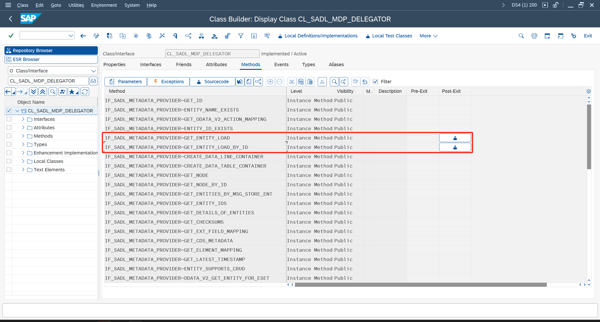

# Fiori开发文档

Fiori内容繁多，该文档只针对项目上实际遇到的问题进行分析，并提供个人的解决方案。

> 对于零基础，可以先按[官方文档](https://sapui5.hana.ondemand.com/sdk/)学习方案入门。
>
> Fiori开发最重要的一点，就是学会查阅官方文档，大部分基础问题，都可以从文档中找到解答。

## 后端

后端主要问题是查询，下面也仅讲解查询。

### 工具类

项目上总结的一套工具，后续都将使用该工具的代码辅助说明：

- [ZCL_ODATA_HELPER](lib/abap/ZCL_ODATA_HELPER.abap.txt)

- [LCL_OSQL_VISTR](lib/abap/LCL_OSQL_VISTR.abap.txt)，为上面的本地类

### 聚合查询增强

先说下聚合查询，也就是使用了Aggregation注解的CDS，在导入ODATA服务后，系统会自动创建一个ID字段，并在查询的时候，对每条记录生成唯一的ID值。

如果要重写聚合查询，须考虑ID值的处理。

> ID值包括了还原该行数据必要的内容：分组条件，筛选条件，排序条件。因此，只要能根据ID值，在GetEntity方法中还原对应行取值，就是可行的。根据这种思路，缓存每次的查询结果是一种可选的方法。
>
> 更极端一点，不考虑GetEntity还原取值，那么只需要给ID值分配随机值即可。

权衡之下，项目选择对齐标准，因此通过增强来复用标准处理。

首先在类 **ZCL_ODATA_HELPER** 中定义全局参数 **GT_BUSINESS_KEY** ，然后对类 **CL_SADL_MDP_DELEGATOR** 的两方法 **GET_ENTITY_LOAD** / **GET_ENTITY_LOAD_BY_ID** ，实施Post-Exit增强：


增强内加入下面代码：

```ABAP
" 用于计算ID值
IF zcl_odata_helper=>gt_business_key IS NOT INITIAL.
    rr_entity_load->query_options-business_key = zcl_odata_helper=>gt_business_key.
ENDIF.
```

最后在代码中调用自定义的 **ZCL_ODATA_HELPER=>FILL_ANALYTICAL_IDS** 方法处理：

```ABAP
" 后端很奇怪的不能获取注解，因此要手工指定聚合列
DATA lt_measure TYPE zcl_odata_helper=>gty_measure_t.
lt_measure = VALUE #(
  function = zcl_odata_helper=>cns_aggregation_type-sum
  ( property = to_upper( 'AMOUNT' ) )
).

" 填充ID值
zcl_odata_helper=>fill_analytical_ids(
  EXPORTING
    i_tech_request_context = io_tech_request_context
    i_dpc                  = if_sadl_gw_dpc_util~get_dpc( )
    i_measures             = lt_measure
  CHANGING
    c_data                 = et_entityset ).
```

### 封装查询结果处理

项目中遇到复杂查询，需要重写GET_ENTITYSET方法，同时也必须要考虑分组，排序，分页这三种情况，因为都是重复代码，所以封装成下面这套模板代码进行处理：

```ABAP
" 对于后付值，前端传入的筛选条件会影响初步查询，需要先去除
DATA lt_remove TYPE stringtab.
lt_remove = VALUE #(
  ( to_upper( cns_field-field1 ) )
).

" 取WHERE语句
DATA(lv_osql) = zcl_acc_odata_helper=>get_osql(
  i_tech_request_context = io_tech_request_context
  i_removes              = lt_remove ).

" 初步查询
SELECT *
  FROM zcds001
  WHERE (lv_osql)
  INTO CORRESPONDING FIELDS OF TABLE @et_entityset.
IF sy-subrc <> 0.
  es_response_context-inlinecount = 0.
  RETURN.
ENDIF.

" TODO，其他处理

" 二次筛选
zcl_acc_odata_helper=>filter(
  EXPORTING
    i_tech_request_context = io_tech_request_context
    i_property             = to_upper( cns_field-field1 )
    i_iniital_value        = space " 保留空值
  CHANGING
    c_entityset            = et_entityset ).

* " 对于分析视图，需要传入聚合列
* DATA lt_measure TYPE zcl_odata_helper=>gty_measure_t.
* lt_measure = VALUE #(
*   function = zcl_odata_helper=>cns_aggregation_type-sum
*   ( property = to_upper( cns_field-field2 ) )
* ).

" 聚合，排序，分页，以及填充ID值
zcl_acc_odata_helper=>after_get_entityset(
  EXPORTING
    i_tech_request_context = io_tech_request_context
    i_dpc                  = if_sadl_gw_dpc_util~get_dpc( )
*    i_measures             = lt_measure
  CHANGING
    c_data                 = et_entityset
    c_response_context     = es_response_context
).
```

## 前端

前端问题比较零碎，并没有能影响到实施的核心问题，因此本节主要对常见需求，以及基于这些需求封装出来的工具，进行说明。

### 通用

[Common.js](lib/js/Common.js)，该工具依赖于controller，需要在onInit方法中初始化，功能包括：i18n取值，导航，加锁解锁（主要是功能前后要求转圈等待）。

```Javascript
// 初始化，写在Controller的onInit方法上，或其他能传入controller的地方也行
Common.init(this);
// i18n取值
Common.i18n.getText("demo");
// 跳转App内页面，填写Router里的ID
Common.navTo("PageID"); 
Common.navBack();
// 加锁解锁
Common.lock();
Common.unlock();
```

### 消息处理

[Message.js](lib/js/Message.js)，该工具封装标准的MessageBox，改为异步处理。

```Javascript
// show/success/error/waring/confirm/toast
Message.show("").then(function (){
    // todo
});

// 特殊定制
var sAction1 = "Action1";
var sAction2 = "Action2";
var sAction3 = sap.m.MessageBox.Action.CLOSE;
Message.showMsgAsync(("Text"), "confirm", [
    sAction1, sAction2, sAction3
]).then(function (sAction) {
    switch (sAction) {
        case sAction1: break;
        case sAction2: break;
        case sAction3: break;    
        default: break;
    }
});

// 展示报错列表
var aDatas = [{
    Key: "Demo",
    Mtype: "E",
    Msg: "Demo"
}]
Message.showMsgTable({
    data: aDatas,
    messageItem: {
        type: "{= ${Mtype} === 'E' ? 'Error' : 'Success'}",
        title: "{Key}",
        subtitle: "{Msg}"
    }
}).then(function () {
    // todo
})
```

### ODATA处理

[Service.js](lib/js/Service.js)，该工具主要将ODATA改为异步处理，同时加入等待逻辑，异常处理逻辑。

```Javascript
// 查询
Service.read(oDataModel, "/", {
    filters: [],
    sorters: [],
    urlParameters: {
        $top: 1
    }
}).then(function (oData) {
    // todo
});
```

说到ODATA，还得说下功能处理，下面是我所使用的方案。

首先创建一个DeepEntity的CDS：

```CDS
define view entity ZCDS001
  as select from demo_ddic_types
  association [0..1] to ZCDS001A as _Head on 1 = 1
  association [*]    to ZCDS001B as _Item on 1 = 1
  association [*]    to ZCDS001C as _Msg  on 1 = 1
{
  key abap.string'' as Action,
      _Head,
      _Item,
      _Msg
}
```

导入ODATA后，重写 **/IWBEP/IF_MGW_APPL_SRV_RUNTIME~CREATE_DEEP_ENTITY** 方法：

```ABAP
" 通常我会将再套一层，以防止修改ODATA的时候丢失代码
DATA(lo_backend) = NEW zcl_backend( ).
" 后端类新建GS_DATA，用于接收入参
io_data_provider->read_entry_data( IMPORTING es_data = lo_backend->gs_data ).
" 入参中有Action字段，用于处理不同功能，该类调用Execute方法即可
lo_backend->execute( ).
" 返回处理结果
copy_data_to_ref(
  EXPORTING
    is_data = lo_backend->gs_data
  CHANGING
    cr_data = er_deep_entity ).
```

前端调用如下：

```Javascript
// 功能处理
var oRequestData = {
    Action: "Demo",
    to_Head: {},
    to_Item: [],
    to_Msg: []
};
Service.request(oDataModel, "/ZCDS001", oRequestData).then(function (oData) {
    // todo
});
```

### 搜索帮助处理

[ValueHelper.js](lib/js/ValueHelper.js)，该工具封装搜索帮助处理。

```Javascript
var that = this;
ValueHelper.openAsync({
    controller: that,
    model: that._oDataModel,
    entitySet: "",
    filterData: {},
    valueHelpDialog: {
        key: "",
        descriptionKey: "",
        title: "",
        supportMultiselect: false
    }
}).then(function (oParamaters) {
    var oItem = oParamaters.aSelectedItems[0];
    // todo
})
```

### 弹窗处理

[DialogHelper.js](lib/js/DialogHelper.js)，该工具封装弹窗处理。

```Javascript
var that = this;
DialogHelper.open({
    controller: that,
    fragment: "XXXX.view.fragment.XXXX",
    ok: function () {
        // todo
    },
    dialog: {
        title: "Demo"
    }
});
```

### SmartTable处理

[SmartTableHelper.js](lib/js/SmartTableHelper.js)，该工具封装SmartTable常用处理。

```Javascript
// 获取SmartTable控件
var oSmartTable = this.byId("");
// eachColumns，常用于初始化时对列进行额外处理
SmartTableHelper.eachColumns(oSmartTable, function (oColumn, sColumnKey) {
    // todo
})
// getSelected，读取勾选行信息
// 常用于功能处理中，获取表格数据作为入参
var oSelected = SmartTableHelper.getSelected(oSmartTable, {deleteMetedata: true});
```

## 源码

[lib-ui5.zip](lib/lib-ui5.zip)

[lib-abap.zip](lib/lib-abap.zip)
